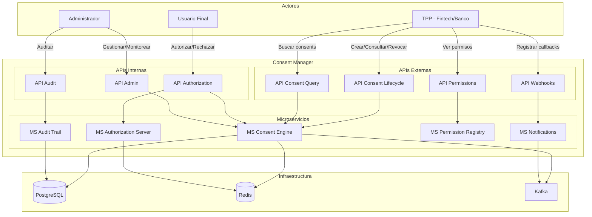

# Integration Consent Manager

[]()
[]()
[]()

## Descripción

Plataforma de gestión de consentimientos para ecosistemas de **Open Finance**. Permite capturar, autorizar, gestionar y revocar el consentimiento del usuario para el acceso, uso y compartición de su información financiera por parte de entidades terceras (TPPs).

Alineado con:
- Decreto 0368 de 2026 (Colombia)
- FAPI 2.0 Security Profile
- Open Banking API v4.0
- ISO 20022

## Arquitectura



### Roles y Permisos

| Actor | Qué puede hacer | APIs que usa |
|---|---|---|
| **TPP** | Crear, consultar y revocar consentimientos | Lifecycle, Query, Webhooks, Permissions |
| **Usuario** | Autorizar o rechazar consentimientos, revocar | Authorization (via Auth Server) |
| **Administrador** | Búsqueda avanzada, revocación masiva, métricas, auditoría | Admin, Audit |

## Proveedores Integrados

| Herramienta | Rol |
|---|---|
| Raidiam | Directory + PKI + DCR |
| Authlete / Curity / Cloudentity / Ping | Authorization Server FAPI 2.0 |
| Transmit Security | SCA: Biometrics + Passkeys |
| ConnectID | Identity Verification (KYC) |

## Developer Portal

🌐 **[Ver Portal](https://somospragma.github.io/integration-consent-manager/)**

Portal interactivo con Swagger UI para probar las APIs directamente.

```bash
# 1. Levantar dependencias
docker compose up -d

# 2. Compilar
cd services/MS-consent-engine && mvn clean package -DskipTests

# 3. Ejecutar
java -jar target/ms-consent-engine-1.0.0-SNAPSHOT.jar

# 4. Probar
curl http://localhost:8080/actuator/health
```

## Tecnologías

| Componente | Tecnología |
|---|---|
| Lenguaje | Java 21 + Spring Boot 3.3 |
| Base de datos | PostgreSQL 16 (Aurora Serverless v2) |
| Cache | Redis 7 (ElastiCache Serverless) |
| Mensajería | Kafka (MSK Serverless) |
| Contenedores | Docker + Kubernetes (EKS) |
| IaC | Terraform |
| Seguridad | FAPI 2.0, mTLS, OAuth 2.0, JWT |

## Equipo

Integration Chapter — Pragma
