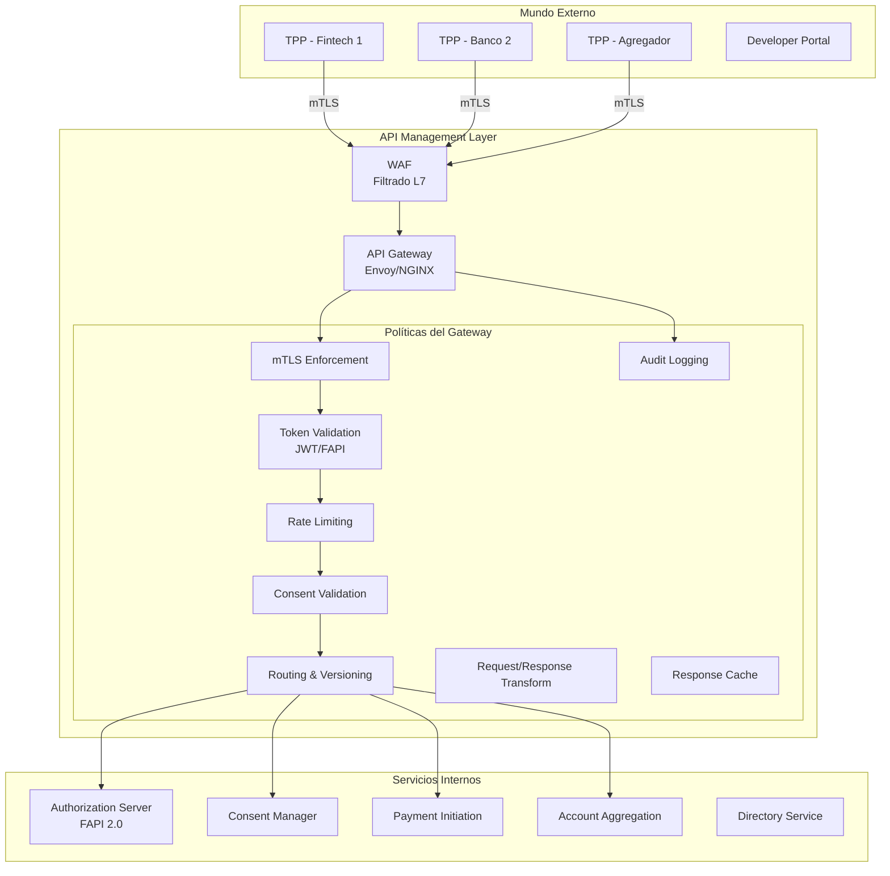
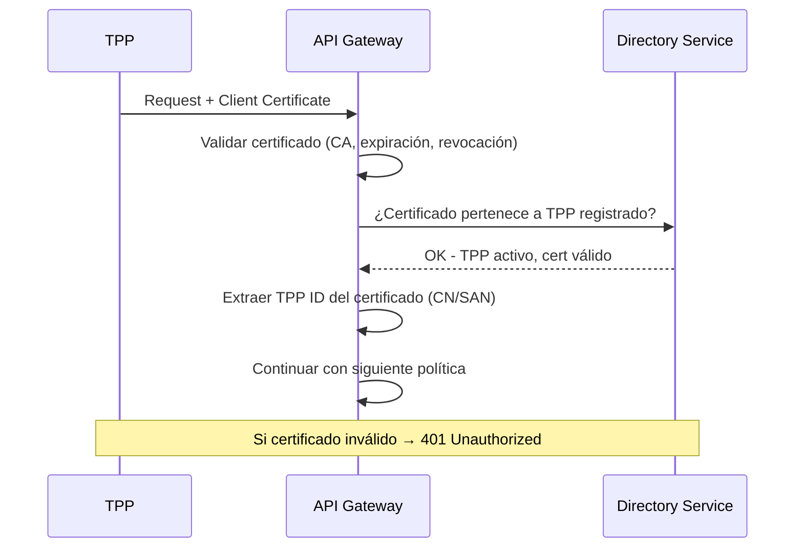
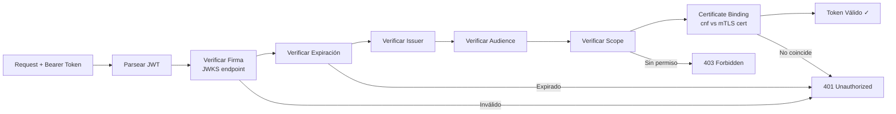
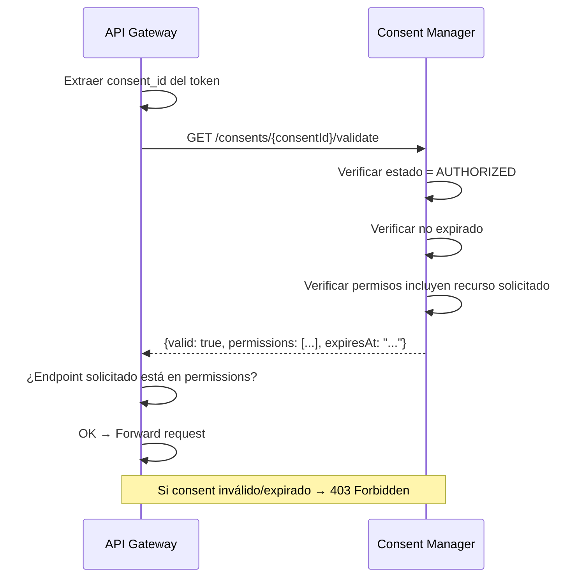
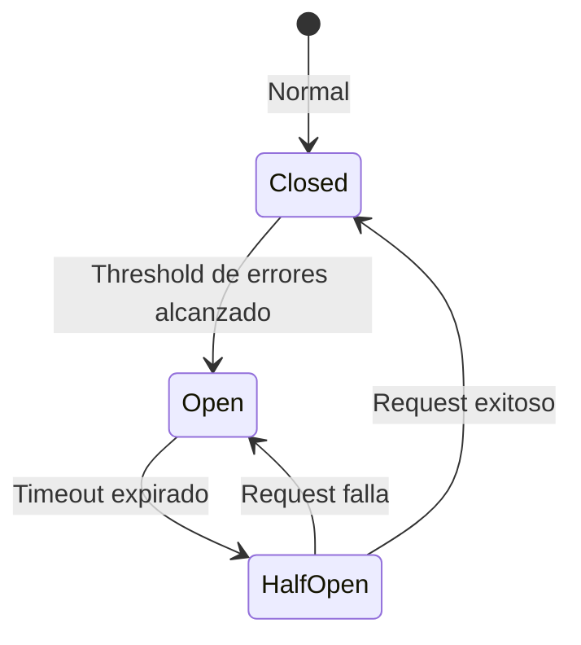
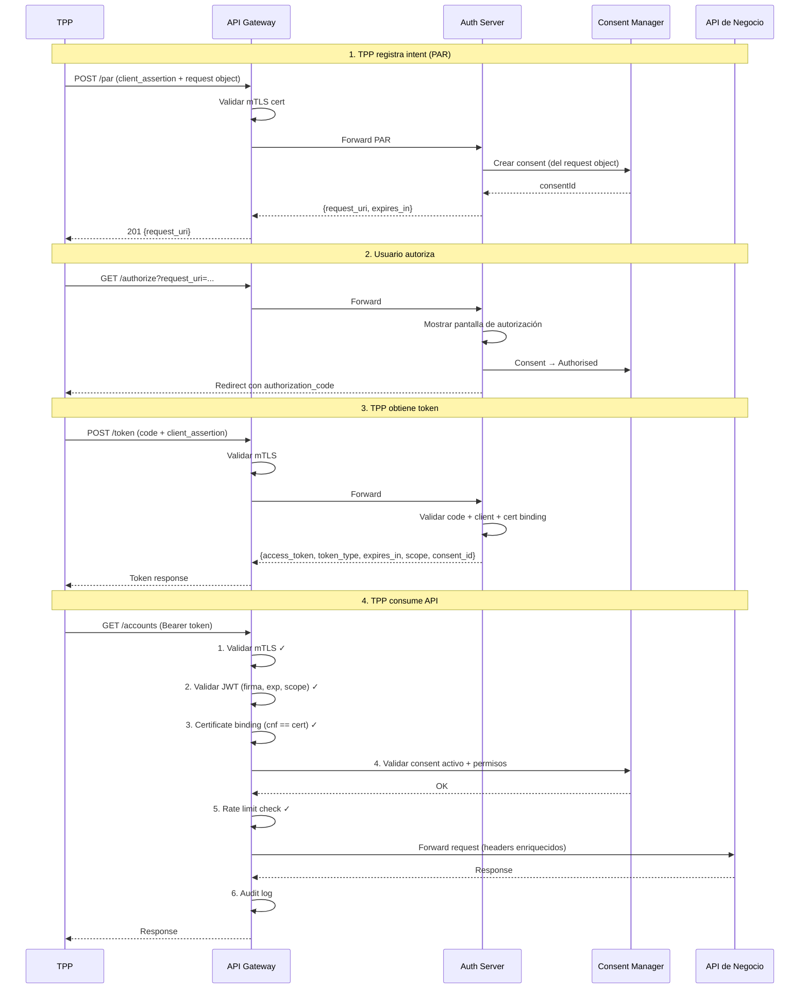
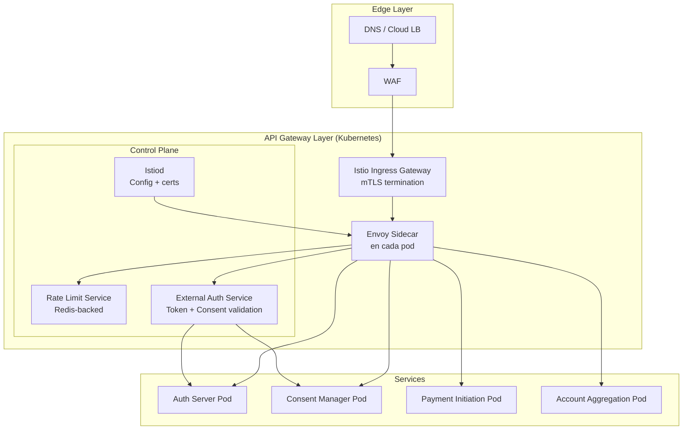

# API Management — Servicios para Gobernar Consent Manager y Authorization Server

## 1. Visión General

El API Management es la capa que **expone, protege, gobierna y monitorea** todas las APIs del ecosistema Open Finance. No es un microservicio más — es la puerta de entrada que orquesta la seguridad entre el mundo externo (TPPs/entidades terceras) y los servicios internos (Consent Manager, Authorization Server, APIs de negocio).



---

## 2. ¿Qué debe tener el API Management?

### Componentes Obligatorios

| # | Componente | Qué hace | Por qué es necesario |
|---|---|---|---|
| 1 | **mTLS Termination & Enforcement** | Valida certificado del TPP en cada request | FAPI 2.0 lo exige — sin certificado válido, no pasa |
| 2 | **Token Validation** | Valida JWT (firma, expiración, scopes, audience) | Solo requests con token válido acceden a recursos |
| 3 | **Consent Enforcement** | Verifica que el token tiene un consentimiento activo | No se puede acceder a datos sin consentimiento vigente |
| 4 | **Rate Limiting & Throttling** | Controla requests por TPP, por API, por usuario | Protege los servicios de abuso y garantiza SLA |
| 5 | **Routing & Load Balancing** | Dirige el tráfico al servicio correcto | Multi-versión, canary, blue-green |
| 6 | **API Versioning** | Soporta múltiples versiones simultáneas | Evolución sin romper integraciones existentes |
| 7 | **Request/Response Transformation** | Adapta headers, body, formatos | Normalización entre versiones |
| 8 | **Audit Logging** | Registra cada request con metadata | Trazabilidad regulatoria obligatoria |
| 9 | **WAF (Web Application Firewall)** | Protege contra ataques L7 (SQLi, XSS, etc.) | Seguridad perimetral |
| 10 | **Developer Portal Integration** | Expone catálogo de APIs, docs, sandbox | Onboarding de TPPs |
| 11 | **Analytics & Monitoring** | Métricas en tiempo real por API/TPP | SLA, troubleshooting, billing |
| 12 | **Circuit Breaker** | Corta tráfico a servicios caídos | Resiliencia |

---

## 3. Servicios Detallados del API Management

### 3.1 mTLS Enforcement Service

**Qué hace:** Valida que cada TPP presente un certificado TLS válido emitido por una CA autorizada del ecosistema.



**Configuración:**

| Parámetro | Valor |
|---|---|
| TLS Version | 1.2 mínimo, 1.3 preferido |
| Client Auth | Required (no optional) |
| CA Trust Store | Certificados del directorio central |
| CRL/OCSP | Verificación de revocación activa |
| Certificate Binding | Vincular cert con token (FAPI requirement) |

---

### 3.2 Token Validation Service

**Qué hace:** Valida el access token JWT en cada request a APIs protegidas.

**Validaciones:**

| Validación | Descripción |
|---|---|
| Firma | Verificar firma RSA/EC con JWKS del Auth Server |
| Expiración | `exp` claim no vencido |
| Issuer | `iss` = nuestro Authorization Server |
| Audience | `aud` = API solicitada |
| Scope | Token tiene el scope requerido para el endpoint |
| Certificate Binding | `cnf` claim coincide con certificado mTLS presentado |
| Consent ID | Token tiene `consent_id` claim válido |
| Not Before | `nbf` claim respetado |

**Flujo:**



---

### 3.3 Consent Enforcement Service

**Qué hace:** Antes de permitir acceso a datos, verifica que existe un consentimiento activo y que los permisos cubren la operación solicitada.

**Flujo:**



**Reglas de enforcement:**

| Endpoint solicitado | Permiso requerido |
|---|---|
| GET /accounts | ReadAccountsBasic |
| GET /accounts/{id} | ReadAccountsDetail |
| GET /balances | ReadBalances |
| GET /transactions | ReadTransactionsBasic |
| POST /domestic-payments | Consent tipo PAYMENT + Authorised |
| POST /domestic-payment-consents | Token con scope `payments` (no necesita consent previo) |

---

### 3.4 Rate Limiting & Throttling Service

**Qué hace:** Controla la cantidad de requests por TPP, por API y por usuario para proteger los servicios y garantizar fairness.

**Niveles de rate limiting:**

| Nivel | Límite | Ventana | Acción al exceder |
|---|---|---|---|
| **Por TPP** | 500 req/min | 1 minuto | 429 + Retry-After |
| **Por TPP + API** | 100 req/min | 1 minuto | 429 + Retry-After |
| **Por TPP + Consent** | 60 req/min | 1 minuto | 429 + Retry-After |
| **Global por API** | 10,000 req/min | 1 minuto | 503 Service Unavailable |
| **Burst** | 50 req/seg | 1 segundo | 429 |

**Algoritmo:** Token Bucket (permite bursts controlados)

**Headers de respuesta:**

```
X-RateLimit-Limit: 500
X-RateLimit-Remaining: 423
X-RateLimit-Reset: 1717200060
Retry-After: 30  (solo cuando se excede)
```

**Configuración por plan/tier:**

| Tier | Requests/min | Burst/seg | Uso |
|---|---|---|---|
| Sandbox | 60 | 10 | Pruebas |
| Basic | 300 | 30 | TPPs pequeños |
| Standard | 500 | 50 | TPPs medianos |
| Premium | 2000 | 200 | TPPs grandes |

---

### 3.5 API Routing & Versioning Service

**Qué hace:** Dirige el tráfico al servicio correcto según la versión, el tipo de recurso y la estrategia de despliegue.

**Estrategia de versionamiento:**

```
Base URL: https://api.openfinance.example.com/v{version}/
```

| Versión | Estado | Ruta |
|---|---|---|
| v1 | Deprecated | /v1/* → servicio legacy |
| v2 | Current | /v2/* → servicio actual |
| v3 | Beta | /v3/* → servicio nuevo (solo sandbox) |

**Routing rules:**

```yaml
routes:
  # Authorization Server
  - match: /v2/authorize
    service: authorization-server
  - match: /v2/token
    service: authorization-server
  - match: /v2/.well-known/openid-configuration
    service: authorization-server

  # Consent Manager
  - match: /v2/account-access-consents*
    service: consent-manager
  - match: /v2/domestic-payment-consents*
    service: consent-manager
  - match: /v2/consents*
    service: consent-manager

  # Payment Initiation
  - match: /v2/domestic-payments*
    service: payment-initiation
  - match: /v2/international-payments*
    service: payment-initiation

  # Account Aggregation
  - match: /v2/accounts*
    service: account-aggregation
  - match: /v2/balances*
    service: account-aggregation
  - match: /v2/transactions*
    service: account-aggregation
```

---

### 3.6 Request/Response Transformation Service

**Qué hace:** Transforma requests y responses para compatibilidad entre versiones y normalización.

**Transformaciones comunes:**

| Tipo | Ejemplo |
|---|---|
| Header injection | Agregar `X-Request-Id`, `X-Correlation-Id` |
| Header forwarding | Pasar `X-Fapi-Interaction-Id` al backend |
| Body transformation | Adaptar payload v1 → v2 |
| Response filtering | Remover campos internos antes de responder |
| Error normalization | Convertir errores internos a formato estándar |

**Headers FAPI obligatorios:**

```
X-Fapi-Interaction-Id: 93bac548-d2de-4546-b106-880a5018460d
X-Fapi-Auth-Date: Sun, 01 Jun 2026 00:00:00 GMT
X-Fapi-Customer-Ip-Address: 104.25.212.99
X-Fapi-Financial-Id: OB/2017/001
```

---

### 3.7 Audit Logging Service

**Qué hace:** Registra cada request que pasa por el gateway con metadata completa para trazabilidad regulatoria.

**Campos del log:**

| Campo | Descripción |
|---|---|
| `timestamp` | ISO 8601 UTC |
| `requestId` | UUID único del request |
| `interactionId` | X-Fapi-Interaction-Id |
| `tppId` | ID del TPP (del certificado) |
| `method` | HTTP method |
| `path` | Endpoint solicitado |
| `statusCode` | HTTP response code |
| `latencyMs` | Tiempo de respuesta |
| `consentId` | ID del consentimiento usado |
| `tokenScopes` | Scopes del token |
| `clientIp` | IP del TPP (enmascarada) |
| `userAgent` | User-Agent del TPP |
| `responseSize` | Tamaño de la respuesta |
| `rateLimitRemaining` | Requests restantes |
| `errorCode` | Código de error (si aplica) |

**Requisitos:**
- Logs inmutables (append-only)
- Retención mínima 5 años
- Exportable para regulador
- No incluir datos sensibles del usuario (solo IDs)

---

### 3.8 Developer Portal Service

**Qué hace:** Provee la interfaz para que los TPPs descubran, prueben y consuman las APIs.

**Funcionalidades:**

| Funcionalidad | Descripción |
|---|---|
| **Catálogo de APIs** | Lista de APIs disponibles con versiones |
| **Documentación interactiva** | OpenAPI specs con "Try it" |
| **Registro de TPP** | Onboarding de nuevas entidades |
| **Gestión de credenciales** | Crear/rotar client_id, client_secret, certificados |
| **Sandbox** | Ambiente de pruebas con datos mock |
| **Dashboard de uso** | Métricas de consumo por API |
| **Logs de requests** | Historial de llamadas del TPP |
| **Status page** | Estado de las APIs en tiempo real |
| **Changelog** | Historial de cambios por versión |
| **Soporte** | Tickets y documentación de errores comunes |

---

### 3.9 Analytics & Monitoring Service

**Qué hace:** Métricas en tiempo real del tráfico, performance y uso de las APIs.

**Métricas clave:**

| Métrica | Descripción | Alerta |
|---|---|---|
| `api_requests_total` | Total de requests por API/TPP | — |
| `api_latency_p50` | Latencia P50 | > 200ms |
| `api_latency_p99` | Latencia P99 | > 2000ms |
| `api_errors_4xx` | Errores de cliente | > 10% del tráfico |
| `api_errors_5xx` | Errores de servidor | > 1% del tráfico |
| `api_rate_limit_exceeded` | Rate limit hits | > 50/min por TPP |
| `mtls_failures` | Fallos de certificado | Cualquiera |
| `token_validation_failures` | Tokens inválidos | > 5% |
| `consent_check_failures` | Consents inválidos | > 5% |
| `api_availability` | Uptime por API | < 99.9% |

**Dashboards:**
- Por API (latencia, throughput, errores)
- Por TPP (consumo, rate limits, errores)
- Global (salud del ecosistema)
- SLA compliance (disponibilidad, tiempos de respuesta)

---

### 3.10 Circuit Breaker Service

**Qué hace:** Protege el sistema cortando tráfico a servicios que están fallando.

**Configuración:**

| Parámetro | Valor |
|---|---|
| Failure threshold | 5 errores consecutivos |
| Open duration | 30 segundos |
| Half-open requests | 3 requests de prueba |
| Monitored errors | 5xx, timeouts |

**Estados:**



---

## 4. Integración con Authorization Server

El API Gateway debe integrarse estrechamente con el Authorization Server para los flujos FAPI 2.0.

### Endpoints del Auth Server expuestos por el Gateway

| Endpoint | Método | Descripción | Protección |
|---|---|---|---|
| `/.well-known/openid-configuration` | GET | Discovery document | Público |
| `/.well-known/jwks.json` | GET | Claves públicas para validar JWT | Público |
| `/authorize` | GET | Inicio del flujo de autorización | mTLS + PAR |
| `/token` | POST | Intercambio de code por token | mTLS + private_key_jwt |
| `/par` | POST | Pushed Authorization Request | mTLS + private_key_jwt |
| `/revoke` | POST | Revocar token | mTLS + private_key_jwt |
| `/introspect` | POST | Introspección de token | mTLS (solo interno) |
| `/userinfo` | GET | Info del usuario | Bearer token |
| `/register` | POST | Dynamic Client Registration | mTLS |

### Flujo completo Gateway + Auth Server + Consent Manager



---

## 5. Políticas por Tipo de Endpoint

No todos los endpoints necesitan las mismas políticas:

| Endpoint | mTLS | Token | Consent | Rate Limit | Audit |
|---|:---:|:---:|:---:|:---:|:---:|
| `/.well-known/*` | ❌ | ❌ | ❌ | ✅ (alto) | ❌ |
| `/par` | ✅ | ❌ (usa client_assertion) | ❌ | ✅ | ✅ |
| `/authorize` | ✅ | ❌ | ❌ | ✅ | ✅ |
| `/token` | ✅ | ❌ (usa client_assertion) | ❌ | ✅ | ✅ |
| `/register` | ✅ | ❌ | ❌ | ✅ (bajo) | ✅ |
| `POST /consents` | ✅ | ✅ (client_credentials) | ❌ | ✅ | ✅ |
| `GET /accounts` | ✅ | ✅ (authorization_code) | ✅ | ✅ | ✅ |
| `GET /balances` | ✅ | ✅ (authorization_code) | ✅ | ✅ | ✅ |
| `GET /transactions` | ✅ | ✅ (authorization_code) | ✅ | ✅ | ✅ |
| `POST /domestic-payments` | ✅ | ✅ (authorization_code) | ✅ | ✅ | ✅ |
| `/metrics` (interno) | ❌ | ❌ | ❌ | ❌ | ❌ |
| `/health` (interno) | ❌ | ❌ | ❌ | ❌ | ❌ |

---

## 6. Infraestructura del API Management

### Stack tecnológico recomendado

| Componente | Tecnología | Justificación |
|---|---|---|
| **API Gateway** | Envoy Proxy | Alto rendimiento, extensible, cloud-native |
| **Ingress Controller** | Istio Gateway | Integrado con service mesh, mTLS nativo |
| **WAF** | ModSecurity / Cloud WAF | Protección L7 estándar |
| **Rate Limiting** | Redis + Envoy RLS | Distribuido, rápido |
| **Service Mesh** | Istio | mTLS pod-to-pod automático |
| **Observabilidad** | OpenTelemetry + Prometheus | Métricas, traces, logs |
| **Config Management** | Kubernetes CRDs | Declarativo, GitOps |
| **Certificate Management** | cert-manager | Rotación automática |

### Diagrama de infraestructura



---

## 7. Resumen — Checklist del API Management

### Must Have (MVP)

- [x] mTLS enforcement (validar certificado del TPP)
- [x] JWT validation (firma, expiración, scopes)
- [x] Certificate binding (FAPI requirement)
- [x] Consent validation (verificar consent activo)
- [x] Rate limiting por TPP
- [x] Routing a servicios internos
- [x] Audit logging de cada request
- [x] WAF básico
- [x] Health checks
- [x] CORS configurado

### Should Have (Fase 2)

- [ ] API versioning con deprecation
- [ ] Request/response transformation
- [ ] Circuit breaker
- [ ] Developer portal integration
- [ ] Analytics dashboard
- [ ] Alerting automático
- [ ] Dynamic client registration
- [ ] API monetization (billing por uso)

### Nice to Have (Fase 3)

- [ ] A/B testing de APIs
- [ ] Canary deployments
- [ ] GraphQL gateway
- [ ] API composition (agregar múltiples backends)
- [ ] Geo-routing
- [ ] Custom plugins por TPP
