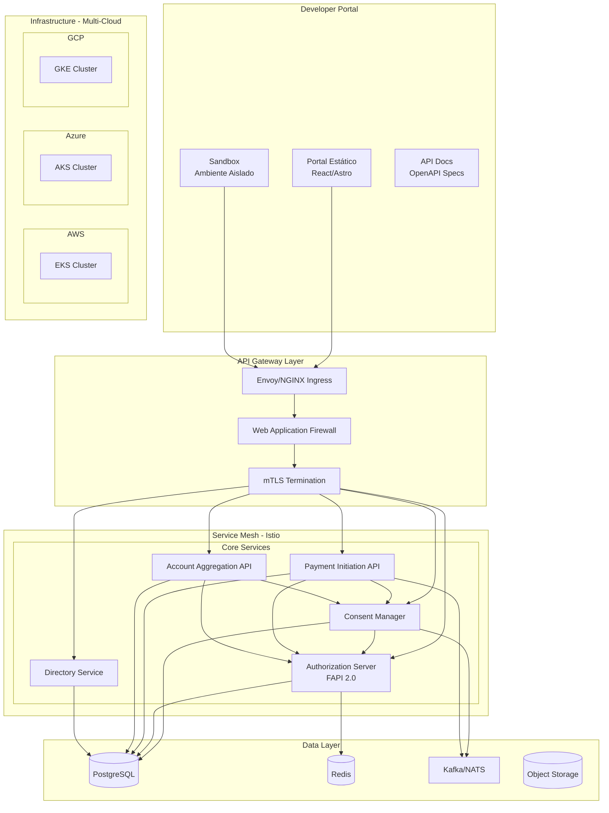
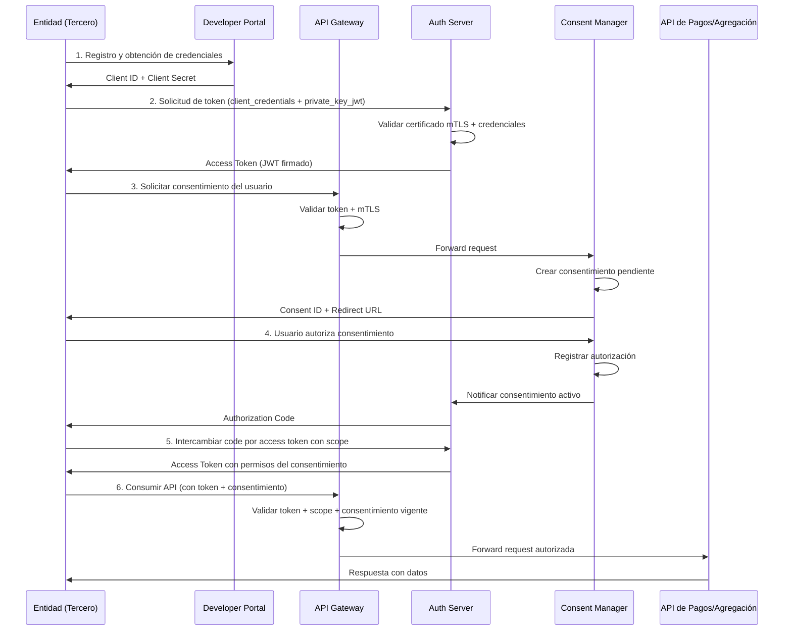

# Arquitectura de Plataforma Open Finance Multi-Nube

## 1. Visión General

Plataforma tecnológica que habilita el ecosistema de Open Finance, permitiendo a entidades financieras consumir aceleradores (APIs) de pagos, agregación de cuentas y gestión de consentimientos, desplegable en AWS, Azure y GCP con una abstracción unificada.

## 2. Principios de Arquitectura

| Principio | Descripción |
|---|---|
| Cloud Agnostic | Mismo código de infraestructura despliega en cualquier nube |
| API-First | Contratos definidos antes de implementación |
| Security by Design | mTLS, FAPI 2.0, cifrado en reposo y tránsito |
| Observable | Trazabilidad completa de cada operación |
| Escalable | Diseño multi-región, preparado para expansión internacional |
| Compliance-Driven | Alineado con Decreto 0368/2026 y SFC |

## 3. Capas de la Arquitectura

### 3.1 Capa de Presentación — Developer Portal

Portal estático donde entidades financieras:
- Descubren los aceleradores disponibles (APIs)
- Leen documentación técnica (OpenAPI specs)
- Prueban en sandbox con datos mock
- Gestionan sus credenciales y API keys
- Entienden el flujo de consentimiento

**Tecnología:** Sitio estático (React/Astro) + CDN + Sandbox aislado

### 3.2 Capa de Gateway — API Management

Punto de entrada único para todas las peticiones:
- Terminación TLS/mTLS
- Autenticación y autorización (validación de tokens FAPI 2.0)
- Rate limiting y throttling
- Routing inteligente a microservicios
- Versionamiento de APIs
- Logging de auditoría

**Tecnología:** Envoy Proxy / NGINX como Ingress Controller + Istio Service Mesh

### 3.3 Capa de Servicios — Microservicios Core

| Servicio | Responsabilidad |
|---|---|
| Consent Manager | Ciclo de vida del consentimiento (crear, consultar, revocar) |
| Authorization Server | Emisión de tokens OAuth2/FAPI 2.0, validación SCA |
| Payment Initiation API | Orquestación de pagos bajo consentimiento |
| Account Aggregation API | Consolidación de información financiera multi-entidad |
| Directory Service | Registro de entidades participantes y ruteo |

### 3.4 Capa de Datos

| Componente | Uso | Tecnología |
|---|---|---|
| Base relacional | Consentimientos, auditoría, entidades | PostgreSQL |
| Cache | Tokens, sesiones, rate limiting | Redis |
| Event Bus | Comunicación asíncrona entre servicios | Kafka/NATS |
| Object Storage | Documentos, logs de auditoría | S3/Blob/GCS |

### 3.5 Capa de Infraestructura

| Componente | AWS | Azure | GCP |
|---|---|---|---|
| Kubernetes | EKS | AKS | GKE |
| Networking | VPC + ALB | VNet + Azure LB | VPC + Cloud LB |
| DNS | Route53 | Azure DNS | Cloud DNS |
| KMS | AWS KMS | Azure Key Vault | Cloud KMS |
| Container Registry | ECR | ACR | Artifact Registry |
| DB Managed | RDS PostgreSQL | Azure DB for PostgreSQL | Cloud SQL |
| Cache | ElastiCache | Azure Cache for Redis | Memorystore |
| CDN | CloudFront | Azure CDN | Cloud CDN |

## 4. Diagrama de Componentes

## 5. Flujo Principal — Consumo de API por Tercero

## 6. Seguridad

### Estándares implementados
- **FAPI 2.0** — Financial-grade API Security Profile
- **OAuth 2.0** con PKCE y private_key_jwt
- **mTLS** — Mutual TLS entre todas las entidades
- **JWT firmado** — Tokens con firma RSA/EC
- **SCA** — Strong Customer Authentication para consentimientos

### Controles
- Cifrado en reposo (KMS por nube)
- Cifrado en tránsito (TLS 1.3)
- Secrets en HashiCorp Vault
- RBAC en Kubernetes
- Network Policies (zero-trust entre pods)
- Audit logs inmutables con timestamp y enmascaramiento

## 7. Observabilidad

| Capa | Herramienta | Propósito |
|---|---|---|
| Métricas | Prometheus + Grafana | SLAs, latencia, throughput |
| Logs | Loki / OpenSearch | Logs centralizados y auditoría |
| Tracing | Tempo / Jaeger | Tracing distribuido entre servicios |
| Alertas | Alertmanager | Notificación de incidentes |
| Instrumentación | OpenTelemetry | Estándar portable de telemetría |

## 8. Multi-Región y Escalabilidad

- **Región primaria:** Colombia (São Paulo AWS/GCP, Brazil South Azure como más cercanas)
- **Diseño:** Preparado para multi-región con replicación de datos
- **Escalamiento:** HPA (Horizontal Pod Autoscaler) por servicio
- **Failover:** DNS-based failover entre regiones/nubes
