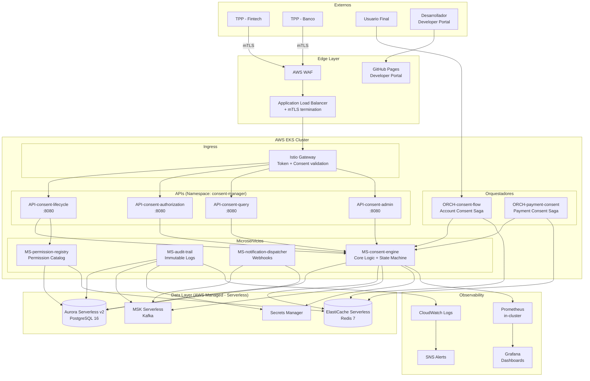
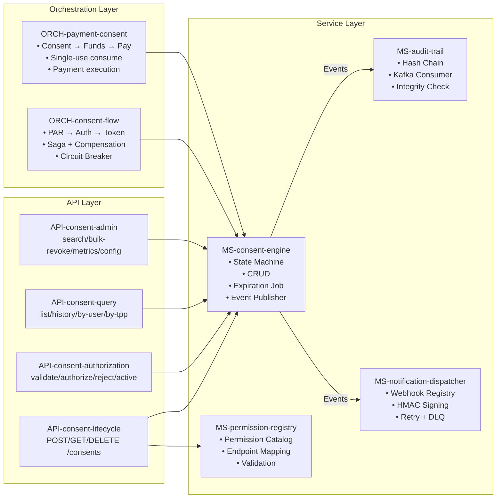
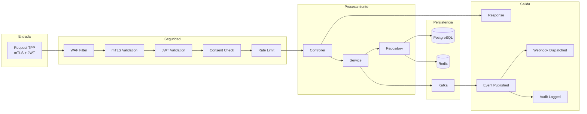
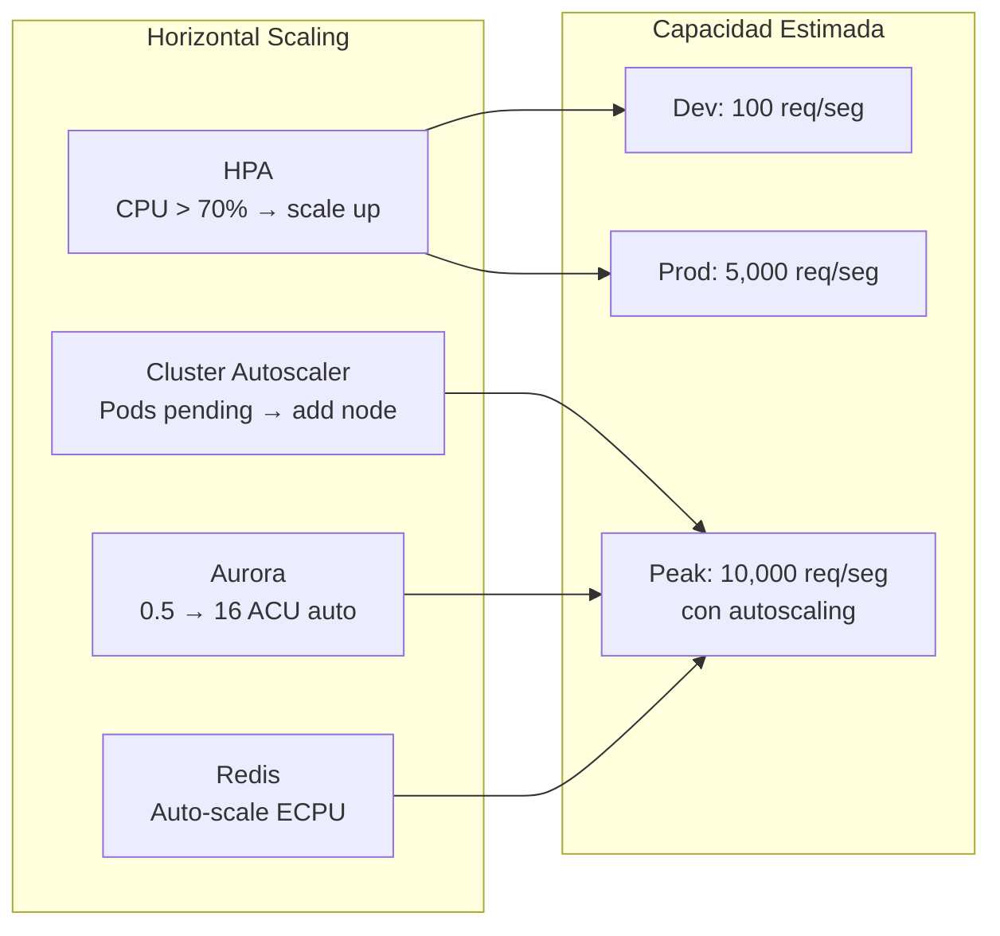

# Arquitectura del Consent Manager Pragma

## 1. Diagrama de Arquitectura General



---

## 2. Diagrama de Componentes Detallado



---

## 3. Diagrama de Infraestructura AWS

```mermaid
graph TB
    subgraph "AWS Region: sa-east-1"
        subgraph "VPC: 10.x.0.0/16"
            subgraph "Public Subnets (2 AZs)"
                ALB[ALB<br/>+ WAF]
                NAT[NAT Gateway]
            end

            subgraph "Private Subnets (2 AZs)"
                subgraph "EKS Cluster"
                    NG[Node Group<br/>t3.medium (Spot/OnDemand)<br/>2-10 nodes]
                end
            end

            subgraph "Database Subnets (isolated)"
                AURORA[(Aurora Serverless v2<br/>0.5-16 ACU<br/>PostgreSQL 16)]
            end
        end

        subgraph "Serverless (VPC-connected)"
            ECACHE[(ElastiCache Serverless<br/>Redis 7<br/>2-10 GB)]
            KAFKA[MSK Serverless<br/>Kafka<br/>Pay per throughput]
        end

        subgraph "Management"
            SM[Secrets Manager]
            KMS[KMS<br/>Encryption Keys]
            ECR[ECR<br/>Container Images]
            CW_LOGS[CloudWatch Logs<br/>14d dev / 5y audit]
        end

        subgraph "Edge"
            GH[GitHub Pages<br/>Developer Portal<br/>$0/mes]
        end
    end

    ALB --> NG
    NG --> AURORA
    NG --> ECACHE
    NG --> KAFKA
    NG --> SM
    NAT --> NG
```

---

## 4. Diagrama de Flujo de Datos



---

## 5. Comunicación entre Servicios

```mermaid
graph TB
    subgraph "Comunicación Síncrona (HTTP/REST)"
        API_LC -->|HTTP| MS_ENGINE
        API_AUTH -->|HTTP| MS_ENGINE
        ORCH_FLOW -->|HTTP| MS_ENGINE
        ORCH_FLOW -->|HTTP| AUTH_SERVER[Auth Server<br/>externo]
        ORCH_PAY -->|HTTP| PAYMENT_SVC[Payment Service<br/>externo]
        ISTIO_GW -->|HTTP| MS_PERM
    end

    subgraph "Comunicación Asíncrona (Kafka Events)"
        MS_ENGINE -->|consent.created| TOPIC[consent-events]
        MS_ENGINE -->|consent.authorized| TOPIC
        MS_ENGINE -->|consent.revoked| TOPIC
        TOPIC -->|consume| MS_AUDIT
        TOPIC -->|consume| MS_NOTIF
    end

    subgraph "Cache (Redis)"
        MS_ENGINE -->|read/write| REDIS_CONSENT[consent:{id}]
        ORCH_FLOW -->|read/write| REDIS_FLOW[consent-flow:{id}]
        ORCH_PAY -->|read/write| REDIS_PAY[payment-flow:{id}]
        MS_PERM -->|read| REDIS_PERM[permissions cache]
    end
```

---

## 6. Sizing y Recursos por Ambiente

### Dev (~$180/mes)

| Recurso | Configuración | Costo estimado |
|---|---|---|
| EKS Control Plane | 1 cluster | $73 |
| EKS Nodes | 2x t3.medium Spot | $30 |
| Aurora Serverless | 0.5 ACU min | $45 |
| ElastiCache Serverless | 2GB max | $10 |
| MSK Serverless | Low throughput | $15 |
| NAT Gateway | 1 (single AZ) | $35 |
| Secrets Manager | 5 secrets | $3 |
| **Total** | | **~$211** |

### Production (~$650/mes)

| Recurso | Configuración | Costo estimado |
|---|---|---|
| EKS Control Plane | 1 cluster | $73 |
| EKS Nodes | 3x m6i.large On-Demand | $280 |
| Aurora Serverless | 1-16 ACU + reader | $120 |
| ElastiCache Serverless | 10GB max | $40 |
| MSK Serverless | Medium throughput | $50 |
| NAT Gateway | 3 (multi-AZ) | $105 |
| WAF | Standard rules | $20 |
| Secrets Manager | 10 secrets | $5 |
| CloudWatch | Logs + alarms | $30 |
| **Total** | | **~$723** |

---

## 7. Decisiones de Arquitectura

| Decisión | Elección | Razón |
|---|---|---|
| Compute | EKS (Kubernetes) | Portable, estándar de industria |
| Database | Aurora Serverless v2 | Escala automático, paga por uso |
| Cache | ElastiCache Serverless | Sin nodos fijos, paga por uso |
| Messaging | MSK Serverless | Kafka sin administrar brokers |
| Service Mesh | Istio | mTLS automático pod-to-pod |
| Observability | Prometheus + CloudWatch | Open source + nativo AWS |
| Secrets | Secrets Manager + KMS | Rotación automática, IAM integration |
| Developer Portal | GitHub Pages + Redoc | $0/mes, open source |
| IaC | Terraform | Agnóstico, portable a otra nube |
| CI/CD | GitHub Actions | Integrado con el repo |

---

## 8. Escalabilidad



| Métrica | Dev | Prod | Peak |
|---|---|---|---|
| Requests/seg | 100 | 5,000 | 10,000 |
| Consentimientos activos | 1K | 500K | 2M |
| Pods MS-consent-engine | 2 | 5-10 | 20 |
| Aurora ACUs | 0.5 | 4-8 | 16 |
| Redis ECPU/seg | 100 | 5,000 | 10,000 |
