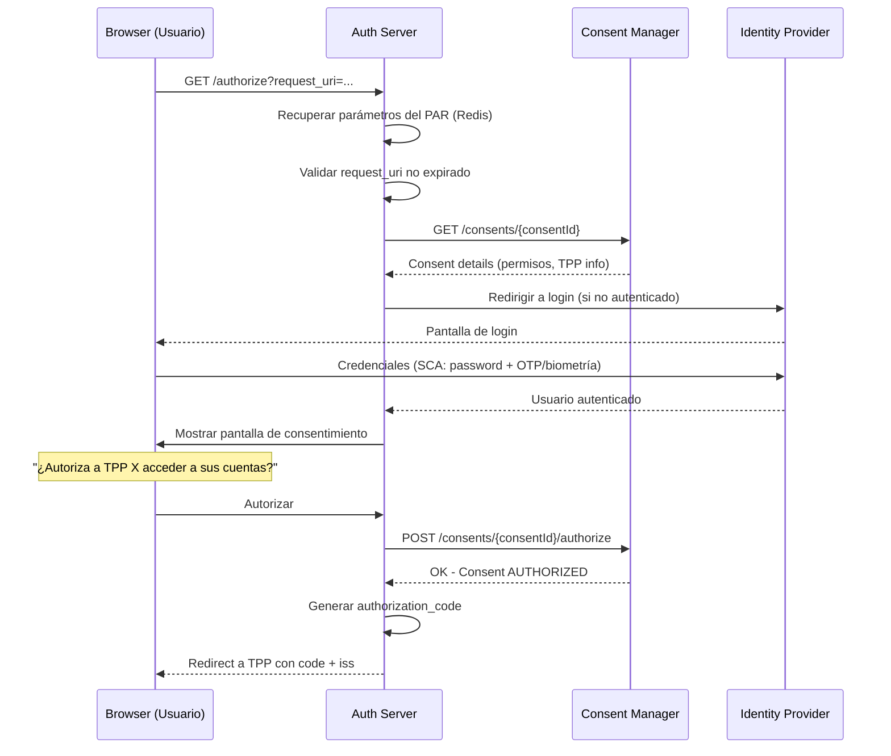
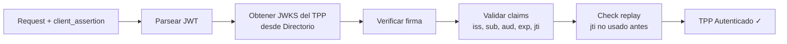
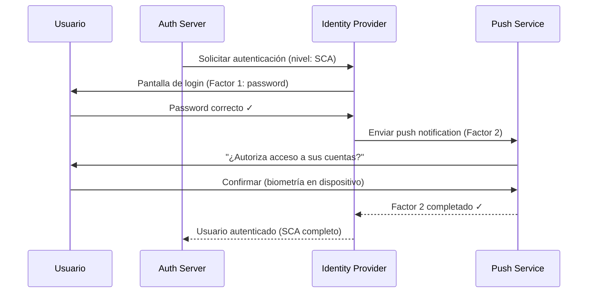
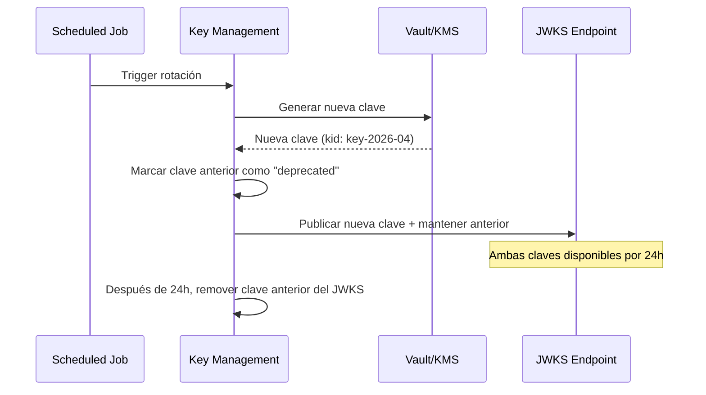
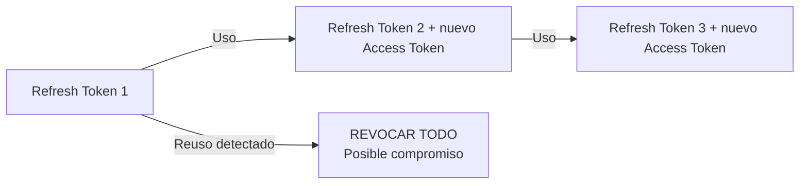
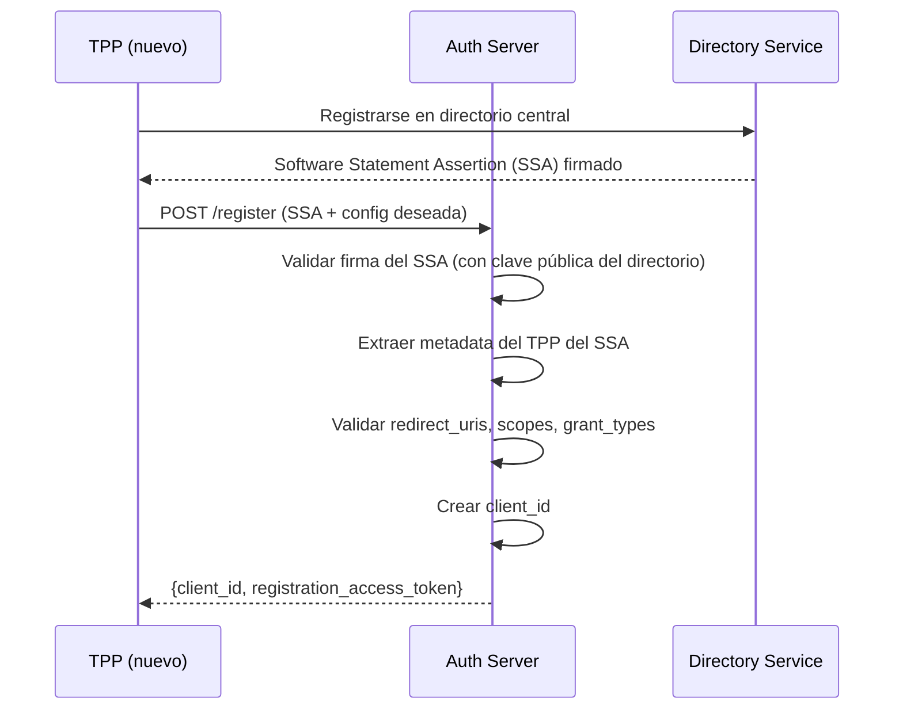
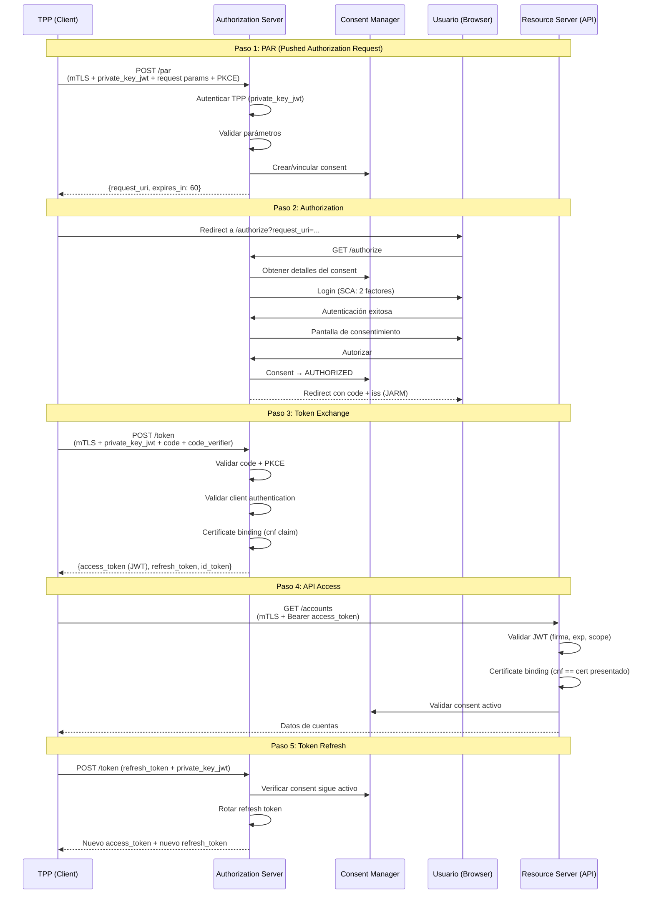
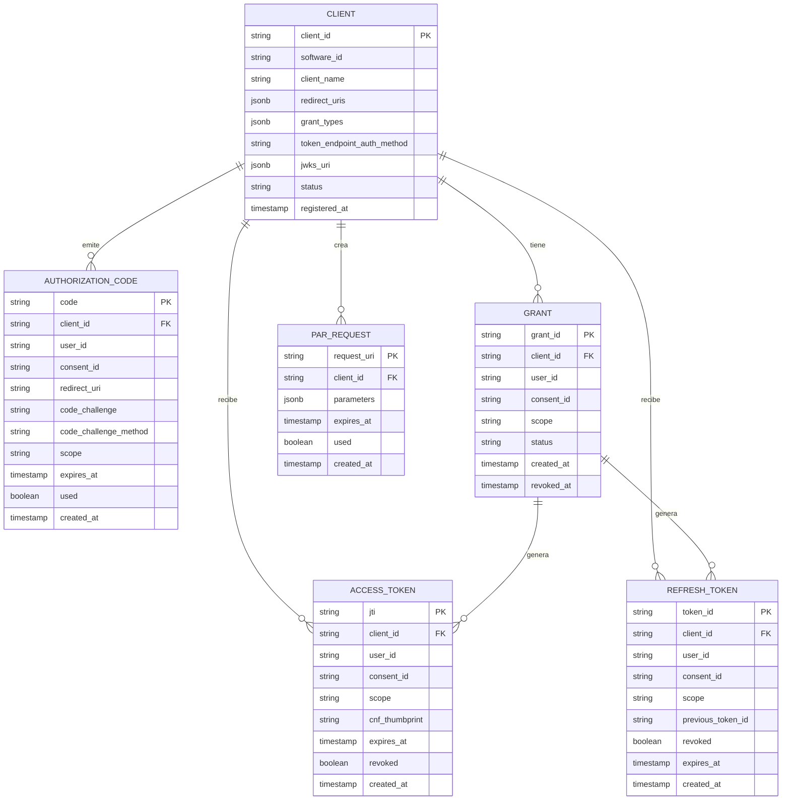

# Authorization Server — Definición Detallada de Servicios

## 1. Visión General

El Authorization Server es el componente responsable de emitir, validar y gestionar tokens de acceso bajo el perfil de seguridad **FAPI 2.0** (Financial-grade API). Actúa como el guardián del acceso: solo entidades autenticadas con consentimiento válido pueden obtener tokens para consumir las APIs del ecosistema.

### Estándares implementados

| Estándar | Versión | Propósito |
|---|---|---|
| OAuth 2.0 | RFC 6749 | Framework base de autorización |
| OpenID Connect | Core 1.0 | Capa de identidad sobre OAuth |
| FAPI 2.0 Security Profile | Final | Perfil de seguridad financiero |
| PAR | RFC 9126 | Pushed Authorization Requests |
| PKCE | RFC 7636 | Proof Key for Code Exchange |
| DPoP / mTLS | RFC 9449 / RFC 8705 | Sender-constrained tokens |
| private_key_jwt | OIDC Core | Autenticación de clientes con JWT firmado |
| JARM | FAPI JARM | JWT Secured Authorization Response Mode |
| RAR | RFC 9396 | Rich Authorization Requests |

---

## 2. Arquitectura del Authorization Server

```mermaid
graph TB
    subgraph "Authorization Server"
        subgraph "Endpoints (Públicos)"
            DISC[Discovery Endpoint<br/>/.well-known/openid-configuration]
            JWKS[JWKS Endpoint<br/>/.well-known/jwks.json]
            PAR_EP[PAR Endpoint<br/>/par]
            AUTH[Authorize Endpoint<br/>/authorize]
            TOKEN[Token Endpoint<br/>/token]
            REVOKE[Revoke Endpoint<br/>/revoke]
            INTROSPECT[Introspect Endpoint<br/>/introspect]
            USERINFO[UserInfo Endpoint<br/>/userinfo]
            DCR[Dynamic Client Registration<br/>/register]
        end

        subgraph "Servicios Internos"
            CLIENT_AUTH[Client Authentication<br/>private_key_jwt / mTLS]
            CONSENT_INT[Consent Integration<br/>Vincular consent con token]
            TOKEN_SVC[Token Service<br/>Emisión JWT firmado]
            SCA_SVC[SCA Service<br/>Strong Customer Authentication]
            KEY_MGR[Key Management<br/>Rotación de claves]
            SESSION_MGR[Session Management<br/>Auth codes, refresh tokens]
            GRANT_MGR[Grant Management<br/>Gestión de grants activos]
        end
    end

    subgraph "Dependencias"
        CM[Consent Manager]
        DIR[Directory Service<br/>TPP Registry]
        VAULT[HashiCorp Vault<br/>Claves privadas]
        REDIS[(Redis<br/>Sessions, codes)]
        PG[(PostgreSQL<br/>Clients, grants)]
        IDP[Identity Provider<br/>Autenticación del usuario]
    end

    PAR_EP --> CLIENT_AUTH
    TOKEN --> CLIENT_AUTH
    AUTH --> SCA_SVC
    AUTH --> CONSENT_INT
    CONSENT_INT --> CM
    CLIENT_AUTH --> DIR
    TOKEN_SVC --> VAULT
    TOKEN_SVC --> KEY_MGR
    SESSION_MGR --> REDIS
    GRANT_MGR --> PG
    SCA_SVC --> IDP
```



---

## 3. Endpoints del Authorization Server

### 3.1 Discovery Endpoint

**Endpoint:** `GET /.well-known/openid-configuration`
**Protección:** Público (sin autenticación)

Retorna la configuración del servidor para que los clientes se auto-configuren.

```json
{
  "issuer": "https://auth.openfinance.example.com",
  "authorization_endpoint": "https://auth.openfinance.example.com/authorize",
  "token_endpoint": "https://auth.openfinance.example.com/token",
  "pushed_authorization_request_endpoint": "https://auth.openfinance.example.com/par",
  "revocation_endpoint": "https://auth.openfinance.example.com/revoke",
  "introspection_endpoint": "https://auth.openfinance.example.com/introspect",
  "userinfo_endpoint": "https://auth.openfinance.example.com/userinfo",
  "registration_endpoint": "https://auth.openfinance.example.com/register",
  "jwks_uri": "https://auth.openfinance.example.com/.well-known/jwks.json",
  "scopes_supported": ["openid", "accounts", "payments", "funds-confirmations"],
  "response_types_supported": ["code"],
  "response_modes_supported": ["jwt"],
  "grant_types_supported": ["authorization_code", "client_credentials", "refresh_token"],
  "token_endpoint_auth_methods_supported": ["private_key_jwt", "tls_client_auth"],
  "token_endpoint_auth_signing_alg_values_supported": ["PS256", "ES256"],
  "id_token_signing_alg_values_supported": ["PS256", "ES256"],
  "request_object_signing_alg_values_supported": ["PS256", "ES256"],
  "subject_types_supported": ["pairwise"],
  "code_challenge_methods_supported": ["S256"],
  "tls_client_certificate_bound_access_tokens": true,
  "require_pushed_authorization_requests": true,
  "authorization_response_iss_parameter_supported": true,
  "dpop_signing_alg_values_supported": ["PS256", "ES256"]
}
```

### 3.2 JWKS Endpoint

**Endpoint:** `GET /.well-known/jwks.json`
**Protección:** Público

Expone las claves públicas para que los Resource Servers validen los JWT emitidos.

```json
{
  "keys": [
    {
      "kty": "RSA",
      "use": "sig",
      "kid": "auth-server-key-2026-01",
      "alg": "PS256",
      "n": "...",
      "e": "AQAB"
    },
    {
      "kty": "EC",
      "use": "sig",
      "kid": "auth-server-key-ec-2026-01",
      "alg": "ES256",
      "crv": "P-256",
      "x": "...",
      "y": "..."
    }
  ]
}
```

**Requisitos:**
- Rotación de claves cada 90 días
- Mantener clave anterior activa 24h después de rotación
- Claves privadas almacenadas en Vault/KMS

---

### 3.3 Pushed Authorization Request (PAR) Endpoint

**Endpoint:** `POST /par`
**Protección:** mTLS + private_key_jwt
**RFC:** 9126

El TPP envía los parámetros de autorización directamente al servidor (no en la URL del browser). Esto previene manipulación y filtración de datos sensibles.

**Request:**

```http
POST /par HTTP/1.1
Host: auth.openfinance.example.com
Content-Type: application/x-www-form-urlencoded

client_assertion_type=urn:ietf:params:oauth:client-assertion-type:jwt-bearer
&client_assertion=eyJhbGciOiJQUzI1NiIsImtpZCI6InRwcC1rZXktMSJ9...
&response_type=code
&scope=openid accounts
&redirect_uri=https://tpp.example.com/callback
&code_challenge=E9Melhoa2OwvFrEMTJguCHaoeK1t8URWbuGJSstw-cM
&code_challenge_method=S256
&claims={"id_token":{"openbanking_intent_id":{"value":"consent-id-12345"}}}
```

**Response:**

```json
{
  "request_uri": "urn:example:bwc4JK-ESC0w8acc191e-Y1LTC2",
  "expires_in": 60
}
```

### 3.4 Authorization Endpoint

**Endpoint:** `GET /authorize`
**Protección:** Requiere request_uri de PAR (no acepta parámetros directos)

Inicia el flujo de autorización. En FAPI 2.0, SOLO acepta `request_uri` (de PAR).

**Request:**

```http
GET /authorize?client_id=tpp-client-123&request_uri=urn:example:bwc4JK-ESC0w8acc191e-Y1LTC2 HTTP/1.1
Host: auth.openfinance.example.com
```

**Flujo interno:**



**Response (redirect):**

```http
HTTP/1.1 302 Found
Location: https://tpp.example.com/callback
  ?code=SplxlOBeZQQYbYS6WxSbIA
  &state=af0ifjsldkj
  &iss=https://auth.openfinance.example.com
```

---

### 3.5 Token Endpoint

**Endpoint:** `POST /token`
**Protección:** mTLS + private_key_jwt (o tls_client_auth)

Intercambia authorization_code por access_token, o emite tokens con client_credentials.

#### Grant Type: authorization_code

**Request:**

```http
POST /token HTTP/1.1
Host: auth.openfinance.example.com
Content-Type: application/x-www-form-urlencoded

grant_type=authorization_code
&code=SplxlOBeZQQYbYS6WxSbIA
&redirect_uri=https://tpp.example.com/callback
&code_verifier=dBjftJeZ4CVP-mB92K27uhbUJU1p1r_wW1gFWFOEjXk
&client_assertion_type=urn:ietf:params:oauth:client-assertion-type:jwt-bearer
&client_assertion=eyJhbGciOiJQUzI1NiJ9...
```

**Response:**

```json
{
  "access_token": "eyJhbGciOiJQUzI1NiIsInR5cCI6ImF0K2p3dCIsImtpZCI6ImF1dGgtc2VydmVyLWtleS0yMDI2LTAxIn0...",
  "token_type": "Bearer",
  "expires_in": 900,
  "refresh_token": "8xLOxBtZp8",
  "scope": "openid accounts",
  "id_token": "eyJhbGciOiJQUzI1NiJ9..."
}
```

#### Grant Type: client_credentials

Para operaciones TPP-to-server (crear consents, registrar webhooks).

**Request:**

```http
POST /token HTTP/1.1
Content-Type: application/x-www-form-urlencoded

grant_type=client_credentials
&scope=consents
&client_assertion_type=urn:ietf:params:oauth:client-assertion-type:jwt-bearer
&client_assertion=eyJhbGciOiJQUzI1NiJ9...
```

#### Grant Type: refresh_token

**Request:**

```http
POST /token HTTP/1.1
Content-Type: application/x-www-form-urlencoded

grant_type=refresh_token
&refresh_token=8xLOxBtZp8
&client_assertion_type=urn:ietf:params:oauth:client-assertion-type:jwt-bearer
&client_assertion=eyJhbGciOiJQUzI1NiJ9...
```

---

### 3.6 Token Revocation Endpoint

**Endpoint:** `POST /revoke`
**Protección:** mTLS + private_key_jwt

**Request:**

```http
POST /revoke HTTP/1.1
Content-Type: application/x-www-form-urlencoded

token=eyJhbGciOiJQUzI1NiJ9...
&token_type_hint=access_token
&client_assertion_type=urn:ietf:params:oauth:client-assertion-type:jwt-bearer
&client_assertion=eyJhbGciOiJQUzI1NiJ9...
```

**Response:** `200 OK` (siempre, incluso si token no existe — para no filtrar info)

---

### 3.7 Token Introspection Endpoint

**Endpoint:** `POST /introspect`
**Protección:** mTLS (solo para Resource Servers internos)

**Request:**

```http
POST /introspect HTTP/1.1
Content-Type: application/x-www-form-urlencoded

token=eyJhbGciOiJQUzI1NiJ9...
```

**Response:**

```json
{
  "active": true,
  "scope": "openid accounts",
  "client_id": "tpp-client-123",
  "token_type": "Bearer",
  "exp": 1717200900,
  "iat": 1717200000,
  "sub": "user-12345",
  "iss": "https://auth.openfinance.example.com",
  "consent_id": "consent-id-12345",
  "cnf": {
    "x5t#S256": "hash-del-certificado-mtls"
  }
}
```

### 3.8 UserInfo Endpoint

**Endpoint:** `GET /userinfo`
**Protección:** Bearer token (access_token con scope openid)

**Response:**

```json
{
  "sub": "user-12345",
  "name": "Juan Pérez",
  "email": "juan@example.com",
  "email_verified": true
}
```

### 3.9 Dynamic Client Registration (DCR)

**Endpoint:** `POST /register`
**Protección:** mTLS + Software Statement Assertion (SSA) del directorio

Permite a TPPs registrarse automáticamente presentando un SSA firmado por el directorio central.

**Request:**

```json
{
  "software_statement": "eyJhbGciOiJQUzI1NiJ9...(SSA firmado por directorio)",
  "redirect_uris": ["https://tpp.example.com/callback"],
  "token_endpoint_auth_method": "private_key_jwt",
  "grant_types": ["authorization_code", "client_credentials", "refresh_token"],
  "response_types": ["code"],
  "scope": "openid accounts payments",
  "id_token_signed_response_alg": "PS256",
  "request_object_signing_alg": "PS256"
}
```

**Response:**

```json
{
  "client_id": "tpp-client-auto-456",
  "client_id_issued_at": 1717200000,
  "token_endpoint_auth_method": "private_key_jwt",
  "grant_types": ["authorization_code", "client_credentials", "refresh_token"],
  "redirect_uris": ["https://tpp.example.com/callback"],
  "scope": "openid accounts payments",
  "software_id": "software-id-from-directory",
  "software_statement": "eyJhbGciOiJQUzI1NiJ9..."
}
```

---

## 4. Servicios Internos Detallados

### 4.1 Client Authentication Service

**Responsabilidad:** Autenticar al TPP en cada request al token/par endpoint.

**Métodos soportados (FAPI 2.0):**

| Método | Cómo funciona | Cuándo se usa |
|---|---|---|
| `private_key_jwt` | TPP firma un JWT con su clave privada, AS valida con clave pública del directorio | Token endpoint, PAR |
| `tls_client_auth` | El certificado mTLS del TPP es suficiente para autenticarlo | Alternativa a private_key_jwt |

**Validaciones de private_key_jwt:**

| Validación | Descripción |
|---|---|
| `iss` | Debe ser el client_id del TPP |
| `sub` | Debe ser el client_id del TPP |
| `aud` | Debe ser la URL del token endpoint |
| `exp` | No expirado (máx 5 minutos de vida) |
| `jti` | Único (prevenir replay attacks) |
| Firma | Validar con JWKS del TPP (del directorio) |



### 4.2 Token Issuance Service

**Responsabilidad:** Generar access tokens JWT firmados con sender-constraint (certificate binding).

**Estructura del Access Token (JWT):**

```json
{
  "header": {
    "alg": "PS256",
    "typ": "at+jwt",
    "kid": "auth-server-key-2026-01"
  },
  "payload": {
    "iss": "https://auth.openfinance.example.com",
    "sub": "user-12345",
    "aud": "https://api.openfinance.example.com",
    "client_id": "tpp-client-123",
    "scope": "openid accounts",
    "consent_id": "consent-id-12345",
    "exp": 1717200900,
    "iat": 1717200000,
    "nbf": 1717200000,
    "jti": "unique-token-id-uuid",
    "cnf": {
      "x5t#S256": "hash-sha256-del-certificado-mtls-del-tpp"
    }
  }
}
```

**Campos críticos:**

| Campo | Propósito |
|---|---|
| `consent_id` | Vincula el token con un consentimiento específico |
| `cnf.x5t#S256` | Certificate binding — el token solo es válido con el certificado mTLS del TPP |
| `scope` | Limita qué APIs puede acceder |
| `exp` | Expiración corta (15 min para access, 90 días para refresh) |

**TTL por tipo de token:**

| Token | TTL | Renovable |
|---|---|---|
| Access Token | 15 minutos | No (usar refresh) |
| Refresh Token | 90 días | Sí (rotation) |
| Authorization Code | 60 segundos | No (single use) |
| ID Token | 15 minutos | No |
| PAR request_uri | 60 segundos | No |

---

### 4.3 Strong Customer Authentication (SCA) Service

**Responsabilidad:** Garantizar que el usuario se autentica con al menos 2 factores antes de autorizar un consentimiento.

**Factores de autenticación:**

| Factor | Categoría | Ejemplos |
|---|---|---|
| Algo que sabe | Knowledge | Password, PIN |
| Algo que tiene | Possession | OTP por SMS, app authenticator, push notification |
| Algo que es | Inherence | Biometría (huella, facial, voz) |

**Requisito FAPI 2.0:** Mínimo 2 factores de categorías diferentes.

**Flujo SCA:**



**Excepciones a SCA (según regulación):**

| Excepción | Cuándo aplica |
|---|---|
| Consulta de saldo | Algunos reguladores permiten sin SCA |
| Pagos de bajo valor | < umbral definido por regulador |
| Beneficiarios de confianza | Previamente registrados |
| Pagos recurrentes (VRP) | Después de la primera autorización |

---

### 4.4 Consent Integration Service

**Responsabilidad:** Vincular el flujo de autorización con el Consent Manager.

**Operaciones:**

| Operación | Cuándo | Qué hace |
|---|---|---|
| Obtener consent | Durante /authorize | Recupera detalles para mostrar al usuario |
| Autorizar consent | Cuando usuario aprueba | Cambia estado a AUTHORIZED |
| Rechazar consent | Cuando usuario rechaza | Cambia estado a REJECTED |
| Vincular consent a token | En /token | Incluye consent_id en el JWT |
| Validar consent vigente | En refresh_token | Verifica que consent sigue activo |
| Revocar tokens | Cuando consent se revoca | Invalida todos los tokens del consent |

```mermaid
graph TB
    subgraph "Auth Server"
        AUTH_FLOW[Authorization Flow]
        TOKEN_FLOW[Token Flow]
        REFRESH_FLOW[Refresh Flow]
    end

    subgraph "Consent Manager"
        GET_C[GET /consents/{id}]
        AUTH_C[POST /consents/{id}/authorize]
        REJ_C[POST /consents/{id}/reject]
        VAL_C[GET /consents/{id}/active]
    end

    AUTH_FLOW -->|1. Obtener detalles| GET_C
    AUTH_FLOW -->|2. Usuario aprueba| AUTH_C
    AUTH_FLOW -->|2. Usuario rechaza| REJ_C
    TOKEN_FLOW -->|3. Verificar consent| VAL_C
    REFRESH_FLOW -->|4. Verificar vigencia| VAL_C
```

### 4.5 Key Management Service

**Responsabilidad:** Gestionar las claves criptográficas del Authorization Server.

**Claves gestionadas:**

| Clave | Uso | Almacenamiento | Rotación |
|---|---|---|---|
| Signing Key (RSA/EC) | Firmar JWT (access tokens, id tokens) | Vault/KMS | Cada 90 días |
| Encryption Key | Cifrar datos sensibles en DB | KMS | Cada 365 días |
| HMAC Key | Firmar authorization codes | Vault | Cada 30 días |

**Proceso de rotación:**



---

### 4.6 Session & Grant Management Service

**Responsabilidad:** Gestionar authorization codes, refresh tokens y grants activos.

**Datos gestionados:**

| Dato | Storage | TTL | Características |
|---|---|---|---|
| Authorization Code | Redis | 60 seg | Single-use, vinculado a PKCE |
| PAR request_uri | Redis | 60 seg | Single-use |
| Refresh Token | PostgreSQL | 90 días | Rotation (nuevo en cada uso) |
| Grant (relación client-user-consent) | PostgreSQL | Vida del consent | Revocable |
| JTI (replay prevention) | Redis | 5 min | Para private_key_jwt |

**Refresh Token Rotation:**

Cada vez que se usa un refresh token, se emite uno nuevo y el anterior se invalida. Si se detecta uso de un refresh token ya rotado → revocar TODOS los tokens del grant (posible robo).



---

### 4.7 Dynamic Client Registration (DCR) Service

**Responsabilidad:** Registrar TPPs automáticamente usando Software Statement Assertions del directorio.

**Flujo:**



**Validaciones del SSA:**

| Validación | Descripción |
|---|---|
| Firma | Firmado por el directorio central (clave pública conocida) |
| Expiración | SSA no expirado |
| Software ID | Software registrado y activo en directorio |
| Roles | TPP tiene roles necesarios (AISP, PISP, etc.) |
| Redirect URIs | Coinciden con los registrados en directorio |

---

## 5. Flujo Completo FAPI 2.0



---

## 6. Requisitos FAPI 2.0 — Checklist del Authorization Server

### OBLIGATORIOS (SHALL)

| # | Requisito | Descripción |
|---|---|---|
| 1 | PAR obligatorio | Solo aceptar authorization requests vía PAR |
| 2 | PKCE con S256 | Code challenge obligatorio en todos los flujos |
| 3 | Sender-constrained tokens | Tokens vinculados al certificado mTLS (cnf claim) |
| 4 | private_key_jwt o tls_client_auth | No aceptar client_secret_basic ni client_secret_post |
| 5 | Response type: code only | No implicit, no hybrid |
| 6 | Issuer identification | Incluir `iss` en authorization response |
| 7 | JARM | Authorization response como JWT firmado |
| 8 | Short-lived auth codes | Máximo 60 segundos, single-use |
| 9 | Refresh token rotation | Nuevo refresh token en cada uso |
| 10 | TLS 1.2+ | Mínimo TLS 1.2, preferir 1.3 |
| 11 | PS256 o ES256 | Algoritmos de firma obligatorios |
| 12 | Exact redirect_uri matching | No wildcards en redirect URIs |
| 13 | No resource owner password grant | Prohibido |
| 14 | No implicit grant | Prohibido |

### RECOMENDADOS (SHOULD)

| # | Requisito | Descripción |
|---|---|---|
| 15 | DPoP como alternativa a mTLS binding | Para clientes que no pueden hacer mTLS |
| 16 | RAR (Rich Authorization Requests) | Para expresar permisos granulares |
| 17 | Grant management | API para que usuario gestione grants activos |
| 18 | Pairwise subject identifiers | No exponer user IDs reales |

---

## 7. Modelo de Datos del Authorization Server



---

## 8. Scopes Soportados

| Scope | Descripción | Grant Type |
|---|---|---|
| `openid` | Identidad del usuario (ID token) | authorization_code |
| `accounts` | Acceso a información de cuentas | authorization_code |
| `payments` | Iniciación de pagos | authorization_code |
| `funds-confirmations` | Confirmación de fondos | authorization_code |
| `consents` | Crear/gestionar consentimientos | client_credentials |

---

## 9. Seguridad y Hardening

| Medida | Implementación |
|---|---|
| Replay prevention | JTI tracking en Redis (5 min TTL) |
| CSRF protection | State parameter + PKCE |
| Token theft mitigation | Certificate binding (cnf) |
| Refresh token theft | Rotation + reuse detection |
| Brute force | Rate limiting en /token y /authorize |
| Open redirect | Exact redirect_uri matching |
| Code injection | Parameterized queries, input validation |
| Key compromise | Rotación automática, HSM/Vault |
| Session fixation | Nuevo session ID post-auth |

---

## 10. Stack Tecnológico Recomendado

| Componente | Opción A (Build) | Opción B (Extend) |
|---|---|---|
| **Base** | Spring Authorization Server | Keycloak + FAPI extensions |
| **Crypto** | Nimbus JOSE+JWT | Nimbus JOSE+JWT |
| **Key Storage** | HashiCorp Vault | Cloud KMS |
| **Session Store** | Redis | Redis |
| **Client Store** | PostgreSQL | PostgreSQL |
| **SCA/MFA** | Custom + push service | Keycloak authenticators |
| **mTLS** | Handled by Istio/Envoy | Handled by Istio/Envoy |

### Consideraciones:

- **Opción A (Build from scratch):** Máximo control, pero requiere implementar toda la spec FAPI 2.0. Recomendado si se quiere certificación FAPI propia.
- **Opción B (Extend Keycloak):** Keycloak ya tiene soporte parcial de FAPI. Se extiende con SPIs custom para consent integration y DCR. Más rápido pero menos flexible.

---

## 11. Resumen de Servicios

| Servicio | Endpoints | Prioridad |
|---|---|---|
| Discovery | 2 (openid-config + jwks) | CRÍTICO |
| PAR | 1 | CRÍTICO |
| Authorization | 1 | CRÍTICO |
| Token | 1 (3 grant types) | CRÍTICO |
| Revocation | 1 | CRÍTICO |
| Introspection | 1 | CRÍTICO |
| UserInfo | 1 | ALTO |
| DCR | 1 (POST + GET + PUT + DELETE) | ALTO |
| Client Authentication | Interno | CRÍTICO |
| Token Issuance | Interno | CRÍTICO |
| SCA | Interno | CRÍTICO |
| Consent Integration | Interno | CRÍTICO |
| Key Management | Interno | CRÍTICO |
| Session/Grant Management | Interno | CRÍTICO |
| **TOTAL endpoints públicos** | **~9** | |
| **TOTAL servicios internos** | **~7** | |
