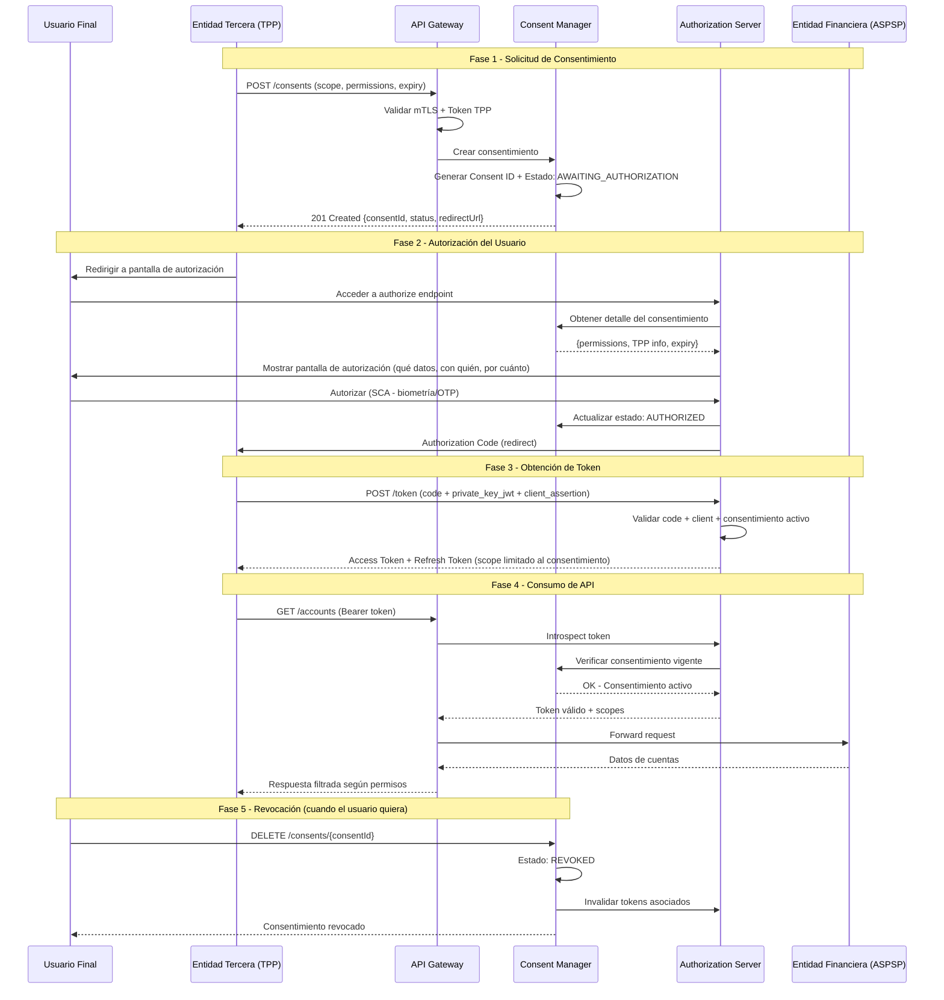
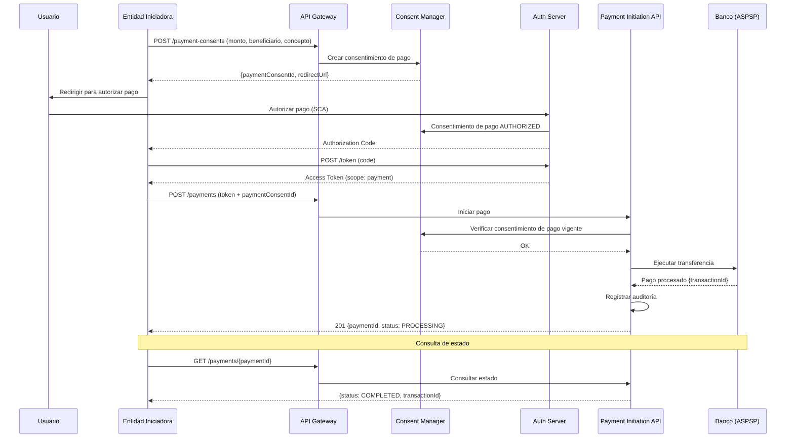
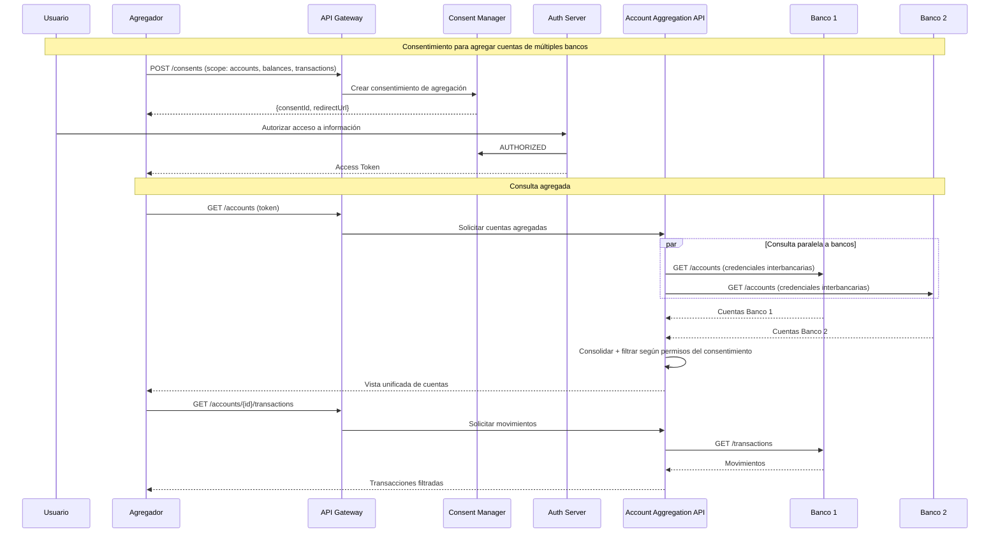
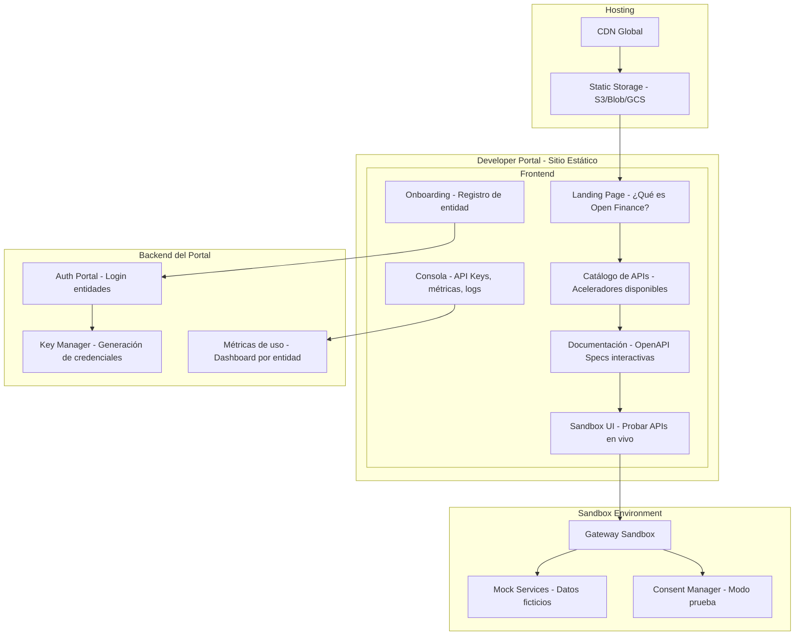
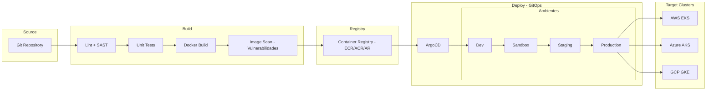
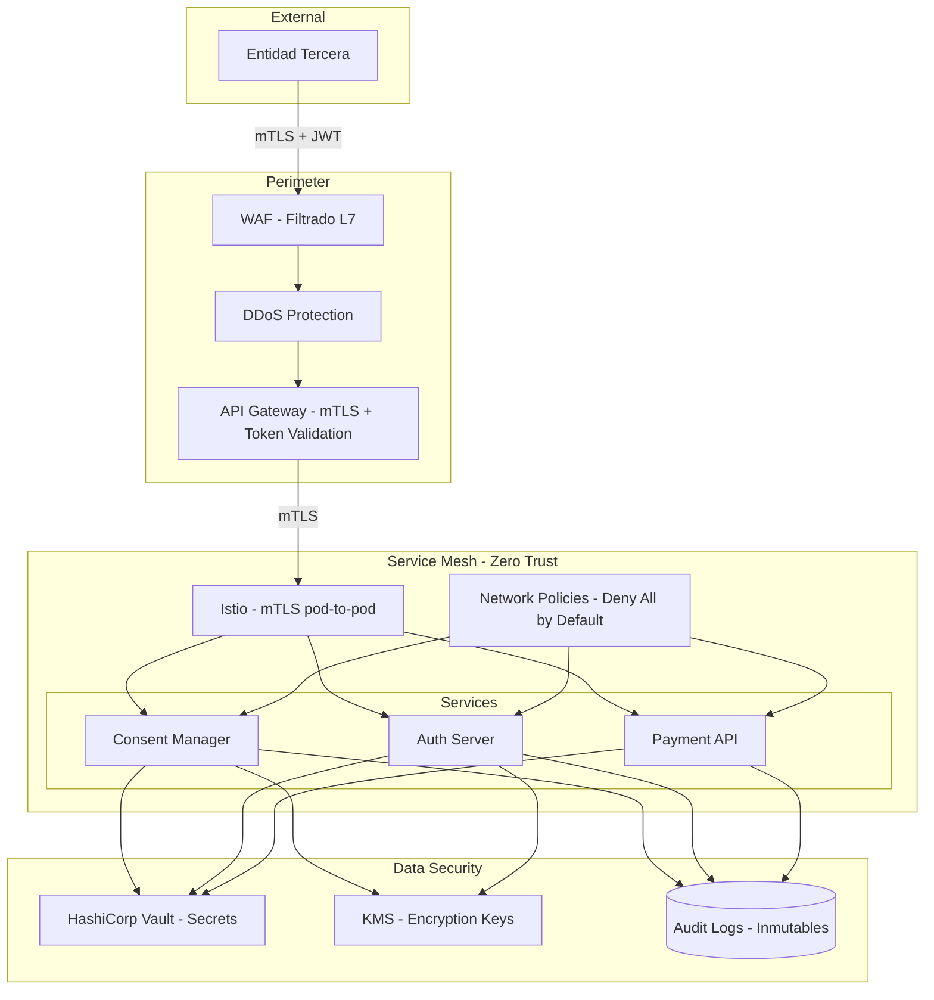
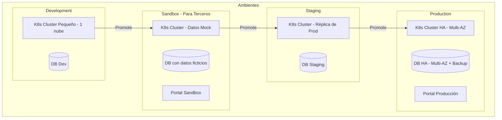

# Diagramas de Arquitectura — Open Finance Multi-Nube

## 1. Arquitectura de Infraestructura Multi-Nube

```mermaid
graph TB
    subgraph "Capa de Abstracción - Terraform"
        TF[Terraform Modules - Cloud Agnostic]
    end

    subgraph "AWS - Region sa-east-1"
        subgraph "VPC AWS"
            ALB_AWS[Application Load Balancer]
            subgraph "EKS Cluster"
                EKS_NG[Node Group - Auto Scaling]
                EKS_PODS[Pods - Microservicios]
            end
            RDS_AWS[(RDS PostgreSQL - Multi-AZ)]
            EC_AWS[(ElastiCache Redis)]
            S3_AWS[(S3 - Logs/Docs)]
        end
        ECR_AWS[ECR - Container Registry]
        KMS_AWS[AWS KMS]
        CF_AWS[CloudFront - Portal CDN]
    end

    subgraph "Azure - Region Brazil South"
        subgraph "VNet Azure"
            ALB_AZ[Azure Load Balancer]
            subgraph "AKS Cluster"
                AKS_NG[Node Pool - Auto Scaling]
                AKS_PODS[Pods - Microservicios]
            end
            PG_AZ[(Azure DB PostgreSQL - HA)]
            RD_AZ[(Azure Cache Redis)]
            BLOB_AZ[(Blob Storage)]
        end
        ACR_AZ[ACR - Container Registry]
        KV_AZ[Azure Key Vault]
        CDN_AZ[Azure CDN - Portal]
    end

    subgraph "GCP - Region southamerica-east1"
        subgraph "VPC GCP"
            GLB_GCP[Cloud Load Balancer]
            subgraph "GKE Cluster"
                GKE_NG[Node Pool - Auto Scaling]
                GKE_PODS[Pods - Microservicios]
            end
            SQL_GCP[(Cloud SQL PostgreSQL - HA)]
            MEM_GCP[(Memorystore Redis)]
            GCS_GCP[(GCS - Logs/Docs)]
        end
        AR_GCP[Artifact Registry]
        KMS_GCP[Cloud KMS]
        CDN_GCP[Cloud CDN - Portal]
    end

    TF --> ALB_AWS
    TF --> ALB_AZ
    TF --> GLB_GCP
```

## 2. Flujo de Consentimiento Completo

## 3. Flujo de Iniciación de Pagos

## 4. Flujo de Agregación de Cuentas

## 5. Arquitectura del Developer Portal

## 6. Pipeline CI/CD Multi-Nube

## 7. Modelo de Seguridad — Zero Trust

## 8. Topología de Ambientes

