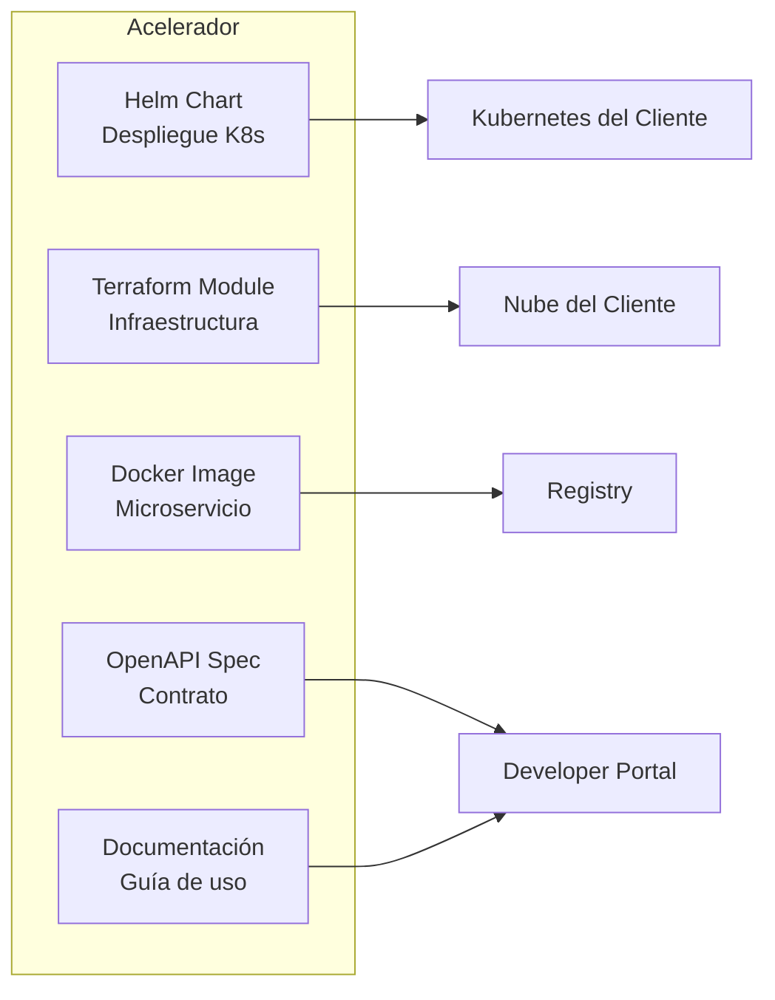
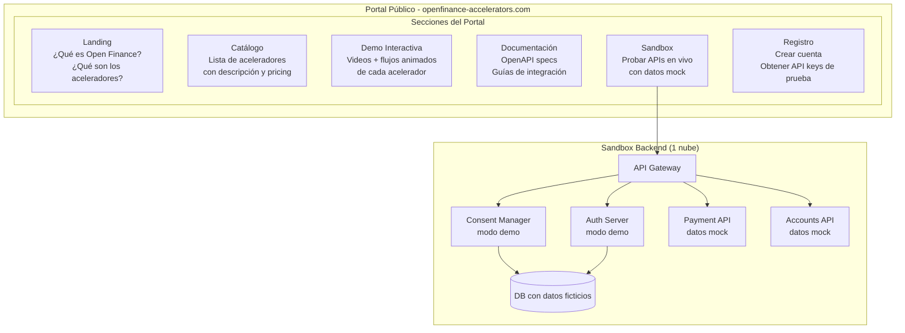
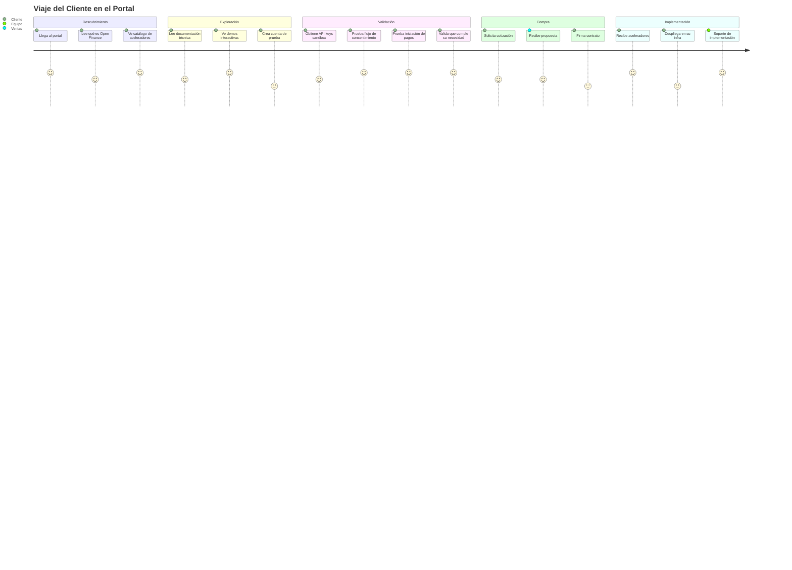
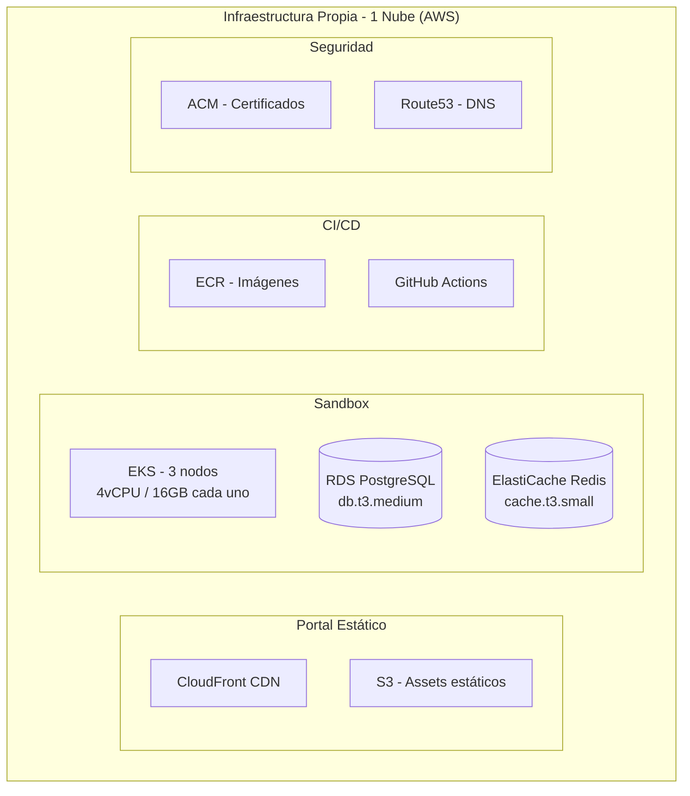
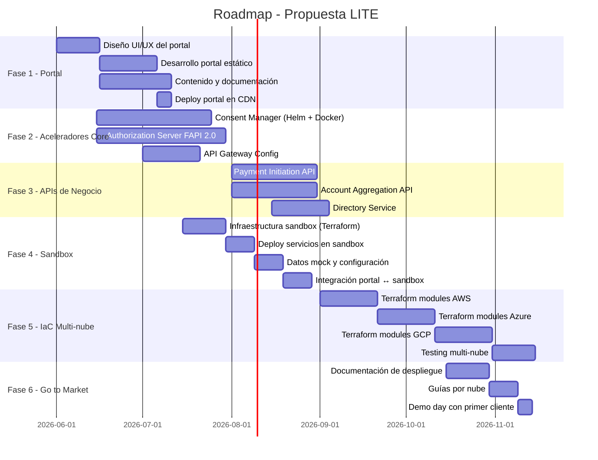

# Propuesta LITE — Aceleradores Open Finance con Portal de Demostración

## Resumen Ejecutivo

Entregar los componentes de Open Finance como **aceleradores empaquetados** (Helm Charts + Terraform + Docker) que se despliegan en la infraestructura del cliente, manteniendo un **portal propio de demostración y sandbox** para que el cliente entienda, pruebe y valide antes de implementar.

---

## 1. ¿Qué es un Acelerador?

Un acelerador es un componente de software listo para desplegar que resuelve una necesidad específica del ecosistema Open Finance:

## 2. Catálogo de Aceleradores

### Aceleradores Core

| # | Acelerador | Qué resuelve | Complejidad |
|---|---|---|---|
| 1 | **Consent Manager** | Gestión completa del ciclo de vida del consentimiento | Alta |
| 2 | **Authorization Server** | Autenticación FAPI 2.0, emisión de tokens, SCA | Alta |
| 3 | **Payment Initiation** | Iniciar pagos bajo consentimiento | Media |
| 4 | **Account Aggregation** | Consolidar información financiera multi-banco | Media |
| 5 | **Directory Service** | Registro de entidades y ruteo | Baja |

### Aceleradores de Infraestructura

| # | Acelerador | Qué resuelve |
|---|---|---|
| 6 | **API Gateway Config** | Ingress + mTLS + rate limiting + routing |
| 7 | **Observability Stack** | Prometheus + Grafana + Loki + alertas |
| 8 | **Security Baseline** | Vault + cert-manager + Network Policies |
| 9 | **CI/CD Templates** | Pipelines para build y deploy |
| 10 | **Developer Portal** | Portal estático desplegable |

---

## 3. Arquitectura del Portal de Demostración

Lo que mantenemos nosotros para que el cliente vea y pruebe:

### Experiencia del Cliente en el Portal

---

## 4. ¿Qué ve el cliente en el Portal?

### 4.1 Landing Page
- Explicación visual de Open Finance en Colombia
- Decreto 0368 y qué implica para las entidades
- Cómo los aceleradores resuelven el cumplimiento
- Casos de uso: pagos, agregación, consentimiento

### 4.2 Catálogo de Aceleradores
- Card por cada acelerador con:
  - Nombre y descripción
  - Qué problema resuelve
  - Diagrama de arquitectura
  - Tecnologías usadas
  - Nubes soportadas (AWS ✓ Azure ✓ GCP ✓)
  - Nivel de complejidad
  - Dependencias

### 4.3 Documentación Interactiva
- OpenAPI specs renderizadas (Swagger UI / Redoc)
- Ejemplos de request/response
- Flujos paso a paso con diagramas
- Guías de despliegue por nube
- Requisitos de infraestructura

### 4.4 Sandbox
- Ambiente real corriendo con datos mock
- El cliente puede:
  - Crear un consentimiento de prueba
  - Obtener tokens OAuth2/FAPI
  - Iniciar un pago ficticio
  - Consultar cuentas mock
  - Ver logs de auditoría
- Todo con credenciales temporales

---

## 5. Infraestructura Necesaria (Propuesta LITE)

### Lo que mantenemos nosotros

### Costo mensual detallado

| Recurso | Spec | Costo USD/mes |
|---|---|---|
| EKS Cluster (control plane) | Managed | $73 |
| EC2 Nodes (3x m5.xlarge) | 4vCPU/16GB x 3 | $420 |
| RDS PostgreSQL | db.t3.medium, 100GB, Multi-AZ | $180 |
| ElastiCache Redis | cache.t3.small, 2 nodos | $70 |
| ALB | Application Load Balancer | $30 |
| CloudFront | CDN para portal | $20 |
| S3 | Storage portal + logs | $10 |
| ECR | Container images | $15 |
| Route53 | DNS | $5 |
| ACM | Certificados SSL | $0 (gratis en AWS) |
| NAT Gateway | Salida a internet | $45 |
| Data Transfer | ~500GB/mes | $45 |
| GitHub Actions | CI/CD minutes | $50 |
| **TOTAL** | | **~$963/mes** |

### Costo anual: ~$11,556 USD

---

## 6. Modelo de Negocio

### Pricing sugerido por acelerador

| Paquete | Incluye | Precio sugerido |
|---|---|---|
| **Starter** | 1 acelerador + soporte básico | $30K - $50K/año |
| **Professional** | 3 aceleradores + soporte prioritario | $80K - $120K/año |
| **Enterprise** | Todos los aceleradores + soporte 24/7 + customización | $150K - $250K/año |
| **Implementación** | Despliegue en infra del cliente | $40K - $80K one-time |
| **Soporte adicional** | Horas de consultoría | $150 - $250/hora |

### Proyección de Revenue

| Clientes | Paquete promedio | Revenue anual |
|---|---|---|
| 1 cliente Enterprise | $200K | $200K |
| 3 clientes Professional | $100K c/u | $300K |
| 5 clientes Starter | $40K c/u | $200K |
| **Total con 9 clientes** | | **$700K** |
| **Costo de infra propia** | | **-$12K** |
| **Margen bruto** | | **$688K (~98%)** |

---

## 7. Roadmap de Implementación

### Timeline estimado: ~5 meses hasta primer cliente

---

## 8. Ventajas de esta Propuesta

| Ventaja | Detalle |
|---|---|
| **Bajo costo operativo** | Solo ~$1K/mes de infra propia |
| **Alto margen** | El cliente paga la infra, nosotros vendemos software |
| **Escalable** | Cada nuevo cliente = revenue sin costo adicional de infra |
| **Multi-nube real** | Los aceleradores corren en cualquier K8s |
| **Rápido time to market** | Portal + sandbox en 2-3 meses |
| **Bajo riesgo** | No se invierte en infra pesada hasta tener clientes |
| **Demostrable** | El sandbox permite que el cliente pruebe antes de comprar |
