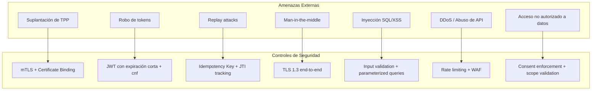
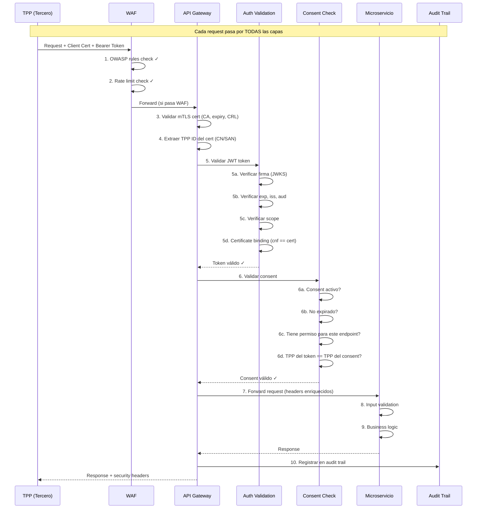

# Seguridad de APIs — Consent Manager Pragma

## 1. Modelo de Amenazas



---

## 2. Capas de Seguridad

### Capa 1: Transporte (TLS/mTLS)

| Control | Implementación |
|---|---|
| TLS versión | 1.3 obligatorio, 1.2 mínimo |
| Cipher suites | Solo suites con Forward Secrecy (ECDHE) |
| mTLS | Obligatorio para todas las APIs externas |
| Certificados TPP | Emitidos por CA del directorio central |
| Validación de certificado | CN/SAN, expiración, CRL/OCSP |
| Certificate pinning | En producción para servicios internos |

**Configuración Istio (service mesh):**
```yaml
apiVersion: security.istio.io/v1
kind: PeerAuthentication
metadata:
  name: consent-manager-mtls
  namespace: consent-manager
spec:
  mtls:
    mode: STRICT  # mTLS obligatorio pod-to-pod
```

### Capa 2: Autenticación (FAPI 2.0)

| Control | Implementación |
|---|---|
| Client authentication | `private_key_jwt` (no client_secret) |
| User authentication | SCA (2 factores obligatorios) |
| Token format | JWT firmado (PS256/ES256) |
| Token binding | `cnf` claim vinculado al certificado mTLS |
| Token lifetime | Access: 15 min, Refresh: 90 días con rotation |
| PAR obligatorio | No se aceptan params en URL del authorize |
| PKCE | S256 obligatorio en todos los flujos |

**Validación de token en cada request:**
```
1. Verificar firma JWT (JWKS del Auth Server)
2. Verificar expiración (exp claim)
3. Verificar issuer (iss == nuestro Auth Server)
4. Verificar audience (aud == API solicitada)
5. Verificar scope (scope incluye recurso solicitado)
6. Verificar certificate binding (cnf.x5t#S256 == hash del cert mTLS)
7. Verificar consent activo (consent_id claim → Consent Manager)
```

### Capa 3: Autorización (Consent-Based)

| Control | Implementación |
|---|---|
| Consent enforcement | Cada request valida consent activo |
| Permission checking | Endpoint → permiso requerido → consent tiene permiso |
| Scope limitation | Token solo accede a lo que el consent permite |
| Time-bound access | Consent tiene expiración (TTL) |
| User-bound | Consent vinculado a un usuario específico |
| TPP-bound | Consent vinculado a un TPP específico |
| Account-bound | Solo cuentas seleccionadas por el usuario |

### Capa 4: Protección de Datos

| Control | Implementación |
|---|---|
| Cifrado en reposo | AWS KMS (AES-256) para DB y storage |
| Cifrado en tránsito | TLS 1.3 para todo el tráfico |
| Enmascaramiento | IPs, datos sensibles en logs |
| Tokenización | IDs internos no expuestos externamente |
| Data minimization | Solo retornar datos que el consent permite |
| PII handling | Pseudonimización en ambientes no-prod |

### Capa 5: Protección contra Abuso

| Control | Implementación |
|---|---|
| Rate limiting | Por TPP: 500 req/min, Global: 10K req/min |
| Throttling | Burst: 50 req/seg máximo |
| WAF | OWASP Top 10 rules |
| DDoS protection | AWS Shield Standard (incluido) |
| Bot detection | User-Agent validation + behavioral analysis |
| IP reputation | Bloqueo de IPs maliciosas conocidas |

### Capa 6: Auditoría y No-Repudio

| Control | Implementación |
|---|---|
| Audit trail | Cada operación registrada con hash encadenado |
| Non-repudiation | JWT firmado por TPP (private_key_jwt) |
| Tamper detection | Hash chain en audit logs |
| Log retention | 5 años mínimo (regulatorio) |
| Log immutability | Triggers que previenen UPDATE/DELETE |
| Correlation | X-Fapi-Interaction-Id en toda la cadena |

---

## 3. Flujo de Seguridad Completo



---

## 4. Headers de Seguridad

### Request headers requeridos

| Header | Obligatorio | Descripción |
|---|---|---|
| `Authorization` | Sí | Bearer token JWT |
| `X-Fapi-Interaction-Id` | Sí | UUID de correlación (trazabilidad) |
| `X-Fapi-Auth-Date` | Sí | Fecha de autenticación del usuario |
| `X-Fapi-Customer-Ip-Address` | Condicional | IP del usuario final |
| `X-Idempotency-Key` | En POST | Clave de idempotencia |
| Client Certificate | Sí (mTLS) | Certificado X.509 del TPP |

### Response headers de seguridad

| Header | Valor | Propósito |
|---|---|---|
| `Strict-Transport-Security` | `max-age=31536000; includeSubDomains` | Forzar HTTPS |
| `X-Content-Type-Options` | `nosniff` | Prevenir MIME sniffing |
| `X-Frame-Options` | `DENY` | Prevenir clickjacking |
| `Cache-Control` | `no-store` | No cachear datos sensibles |
| `X-Fapi-Interaction-Id` | UUID (echo) | Correlación |
| `X-RateLimit-Limit` | 500 | Límite de rate |
| `X-RateLimit-Remaining` | N | Requests restantes |

---

## 5. Validación de Input

### Reglas de validación por campo

| Campo | Validación |
|---|---|
| `consentId` | UUID v4 format |
| `tppId` | Alphanumeric, max 100 chars |
| `permissions` | Array de valores del enum permitido |
| `expiresAt` | ISO 8601, futuro, max 12 meses |
| `amount` | Decimal positivo, max 2 decimales |
| `currency` | ISO 4217 (3 chars) |
| `accountId` | Alphanumeric, max 50 chars |
| URLs | HTTPS only, no localhost, no private IPs |

### Protección contra inyección

```java
// ✅ Correcto: Parameterized queries (JPA)
@Query("SELECT c FROM Consent c WHERE c.tppId = :tppId")
List<Consent> findByTpp(@Param("tppId") String tppId);

// ❌ Incorrecto: String concatenation
// "SELECT * FROM consents WHERE tpp_id = '" + tppId + "'"
```

---

## 6. Gestión de Secretos

| Secreto | Almacenamiento | Rotación |
|---|---|---|
| DB credentials | AWS Secrets Manager (auto-managed by Aurora) | Automática |
| JWT signing keys | AWS KMS | Cada 90 días |
| Webhook HMAC secrets | AWS Secrets Manager | Por TPP, manual |
| Kafka credentials | IAM roles (no passwords) | N/A |
| Redis auth | ElastiCache IAM auth | N/A |
| mTLS certificates | cert-manager (auto-renewal) | 30 días antes de expirar |

**Principio:** Ningún secreto en código, variables de ambiente, o archivos de configuración. Todo en Secrets Manager o KMS.

---

## 7. Checklist de Seguridad por Release

### Pre-deployment

- [ ] SAST scan pasado (SonarQube/Snyk)
- [ ] Dependency scan sin vulnerabilidades críticas
- [ ] Container image scan limpio (Trivy)
- [ ] OpenAPI spec validada (sin endpoints expuestos por error)
- [ ] Secrets no hardcodeados (git-secrets scan)
- [ ] Input validation en todos los endpoints
- [ ] Rate limiting configurado
- [ ] mTLS habilitado

### Post-deployment

- [ ] Penetration test (trimestral)
- [ ] DAST scan (OWASP ZAP)
- [ ] Certificate rotation verificada
- [ ] Audit logs fluyendo correctamente
- [ ] Alertas de seguridad configuradas
- [ ] Backup de DB verificado
- [ ] DR plan probado

---

## 8. Compliance

| Estándar | Requisito | Cómo se cumple |
|---|---|---|
| FAPI 2.0 | Sender-constrained tokens | Certificate binding (cnf) |
| FAPI 2.0 | PAR obligatorio | Solo acepta request_uri |
| Decreto 0368 | Consentimiento explícito | Consent Manager con SCA |
| Ley 1581/2012 | Protección de datos | Cifrado, enmascaramiento, residencia |
| ISO 27001 | Control de acceso | RBAC, mTLS, audit trail |
| PCI DSS | Si aplica (pagos) | Tokenización, cifrado, segmentación |
