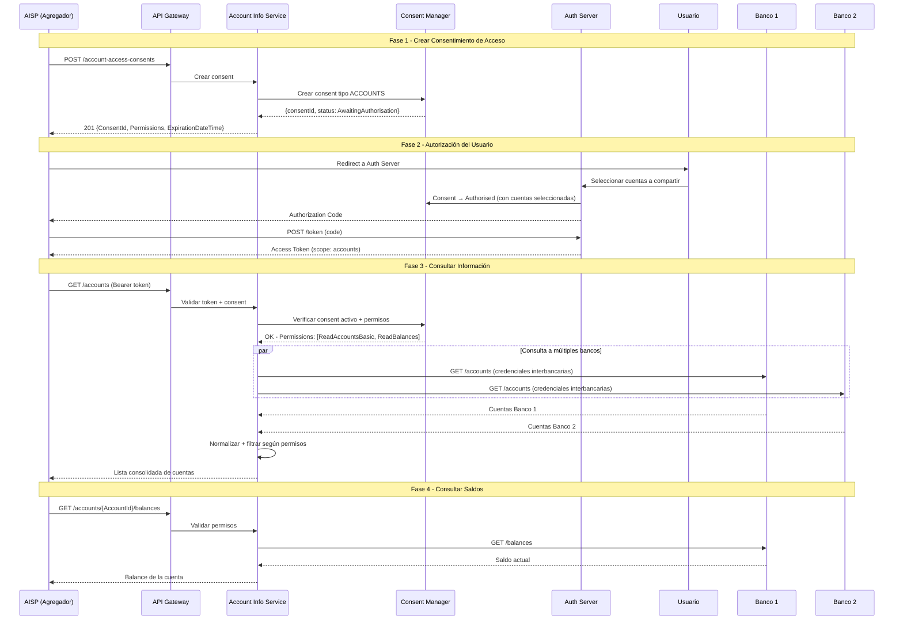
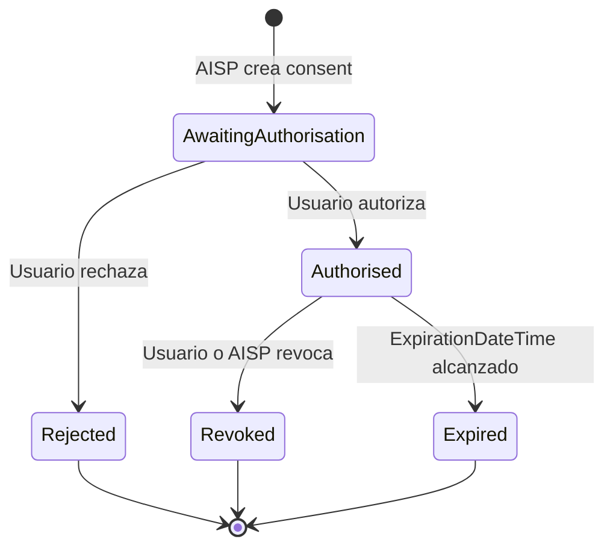
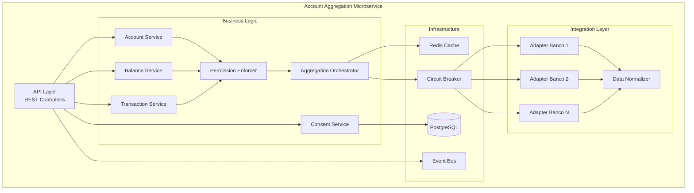

# Servicios de Agregación de Cuentas (Account Information)

## Referencia

Basado en los estándares de Open Banking UK (v4.0), Open Finance Brasil, y la arquitectura de plataformas como Capgemini Open Banking, Sensedia y Ozone API.

Fuentes:
- [Open Banking UK - Account and Transaction API v4.0](https://openbankinguk.github.io/read-write-api-site3/v4.0/resources-and-data-models/aisp/Accounts.html)
- [Open Banking UK - Account Information Services](https://standards.openbanking.org.uk/customer-experience-guidelines/account-information-services/latest)
- [AWS Well-Architected Financial Services Lens](https://docs.aws.amazon.com/wellarchitected/latest/financial-services-industry-lens/open-banking.html)

---

## 1. Visión General

El servicio de Agregación de Cuentas permite a un AISP (Account Information Service Provider) — una entidad tercera autorizada — acceder a la información financiera del usuario (cuentas, saldos, movimientos, productos) de múltiples entidades bancarias, con su consentimiento explícito.

### Recursos de Información Disponibles

| Recurso | Descripción |
|---|---|
| **Accounts** | Lista de cuentas del usuario |
| **Balances** | Saldos actuales de cada cuenta |
| **Transactions** | Movimientos/transacciones |
| **Beneficiaries** | Beneficiarios registrados |
| **Direct Debits** | Débitos automáticos |
| **Standing Orders** | Órdenes permanentes activas |
| **Products** | Productos financieros asociados |
| **Offers** | Ofertas disponibles para el usuario |
| **Parties** | Información del titular de la cuenta |
| **Statements** | Extractos bancarios |
| **Scheduled Payments** | Pagos programados |

---

## 2. Arquitectura de Servicios

```mermaid
graph TB
    subgraph "Account Aggregation Services"
        subgraph "Consent Service"
            AAC[Account Access Consent<br/>Crear, consultar, revocar]
        end

        subgraph "Account Information Resources"
            ACC[Accounts Service]
            BAL[Balances Service]
            TXN[Transactions Service]
            BEN[Beneficiaries Service]
            DD[Direct Debits Service]
            SO[Standing Orders Service]
            PRD[Products Service]
            OFF[Offers Service]
            PTY[Parties Service]
            STM[Statements Service]
            SP[Scheduled Payments Service]
        end

        subgraph "Aggregation Services"
            AGG[Multi-Bank Aggregator<br/>Consolidar de múltiples bancos]
            CACHE[Cache Service<br/>Datos recientes en cache]
            NORM[Normalizer<br/>Normalizar formatos entre bancos]
        end

        subgraph "Support Services"
            AUD[Audit Service]
            MET[Metrics Service]
            WH[Webhook Service]
        end
    end

    subgraph "Dependencias"
        CM[Consent Manager]
        AS[Authorization Server]
        B1[Banco 1 API]
        B2[Banco 2 API]
        B3[Banco N API]
    end

    AAC --> CM
    ACC --> AGG
    AGG --> B1
    AGG --> B2
    AGG --> B3
    AGG --> NORM
    AGG --> CACHE
    ACC --> AUD
```



---

## 3. Flujo Principal — Agregación de Cuentas



---

## 4. Servicios y Endpoints Detallados

### 4.1 Account Access Consents

| Método | Endpoint | Descripción |
|---|---|---|
| POST | `/account-access-consents` | Crear consentimiento de acceso a cuentas |
| GET | `/account-access-consents/{ConsentId}` | Obtener detalle del consentimiento |
| DELETE | `/account-access-consents/{ConsentId}` | Revocar consentimiento |

#### Request Body — POST /account-access-consents

```json
{
  "Data": {
    "Permissions": [
      "ReadAccountsBasic",
      "ReadAccountsDetail",
      "ReadBalances",
      "ReadTransactionsBasic",
      "ReadTransactionsDetail",
      "ReadTransactionsCredits",
      "ReadTransactionsDebits",
      "ReadBeneficiariesBasic",
      "ReadBeneficiariesDetail",
      "ReadProducts",
      "ReadOffers",
      "ReadParty",
      "ReadStatementsBasic",
      "ReadStatementsDetail",
      "ReadDirectDebits",
      "ReadStandingOrdersBasic",
      "ReadStandingOrdersDetail",
      "ReadScheduledPaymentsBasic",
      "ReadScheduledPaymentsDetail"
    ],
    "ExpirationDateTime": "2027-06-01T00:00:00Z",
    "TransactionFromDateTime": "2026-01-01T00:00:00Z",
    "TransactionToDateTime": "2026-12-31T23:59:59Z"
  }
}
```

### 4.2 Accounts

| Método | Endpoint | Descripción |
|---|---|---|
| GET | `/accounts` | Listar todas las cuentas autorizadas |
| GET | `/accounts/{AccountId}` | Detalle de una cuenta específica |

#### Response — GET /accounts

```json
{
  "Data": {
    "Account": [
      {
        "AccountId": "22289",
        "Status": "Enabled",
        "StatusUpdateDateTime": "2026-01-01T06:06:06Z",
        "Currency": "COP",
        "AccountType": "Personal",
        "AccountSubType": "CurrentAccount",
        "Nickname": "Mi cuenta principal",
        "Account": [
          {
            "SchemeName": "CO.CBB.AccountNumber",
            "Identification": "80200110203345",
            "Name": "Juan Pérez"
          }
        ]
      }
    ]
  }
}
```

### 4.3 Balances

| Método | Endpoint | Descripción |
|---|---|---|
| GET | `/accounts/{AccountId}/balances` | Saldos de una cuenta |
| GET | `/balances` | Saldos de todas las cuentas (bulk) |

#### Response — GET /accounts/{id}/balances

```json
{
  "Data": {
    "Balance": [
      {
        "AccountId": "22289",
        "CreditDebitIndicator": "Credit",
        "Type": "InterimAvailable",
        "DateTime": "2026-06-01T08:00:00Z",
        "Amount": {
          "Amount": "1230.00",
          "Currency": "COP"
        }
      },
      {
        "AccountId": "22289",
        "CreditDebitIndicator": "Credit",
        "Type": "InterimBooked",
        "DateTime": "2026-06-01T08:00:00Z",
        "Amount": {
          "Amount": "1200.00",
          "Currency": "COP"
        }
      }
    ]
  }
}
```

### 4.4 Transactions

| Método | Endpoint | Descripción |
|---|---|---|
| GET | `/accounts/{AccountId}/transactions` | Movimientos de una cuenta |
| GET | `/transactions` | Movimientos de todas las cuentas (bulk) |

#### Parámetros de query

| Parámetro | Tipo | Descripción |
|---|---|---|
| `fromBookingDateTime` | DateTime | Desde fecha |
| `toBookingDateTime` | DateTime | Hasta fecha |
| `page` | int | Paginación |

#### Response — GET /accounts/{id}/transactions

```json
{
  "Data": {
    "Transaction": [
      {
        "AccountId": "22289",
        "TransactionId": "123",
        "TransactionReference": "Ref 1",
        "Status": "Booked",
        "BookingDateTime": "2026-05-30T10:00:00Z",
        "ValueDateTime": "2026-05-30T10:00:00Z",
        "CreditDebitIndicator": "Debit",
        "Amount": {
          "Amount": "50.00",
          "Currency": "COP"
        },
        "TransactionInformation": "Pago Nequi - Restaurante XYZ",
        "BankTransactionCode": {
          "Code": "ReceivedCreditTransfer",
          "SubCode": "DomesticCreditTransfer"
        },
        "MerchantDetails": {
          "MerchantName": "Restaurante XYZ",
          "MerchantCategoryCode": "5812"
        }
      }
    ]
  },
  "Links": {
    "Self": "/accounts/22289/transactions?page=1",
    "Next": "/accounts/22289/transactions?page=2"
  },
  "Meta": {
    "TotalPages": 5
  }
}
```

### 4.5 Beneficiaries

| Método | Endpoint | Descripción |
|---|---|---|
| GET | `/accounts/{AccountId}/beneficiaries` | Beneficiarios de una cuenta |
| GET | `/beneficiaries` | Todos los beneficiarios (bulk) |

### 4.6 Direct Debits

| Método | Endpoint | Descripción |
|---|---|---|
| GET | `/accounts/{AccountId}/direct-debits` | Débitos automáticos de una cuenta |
| GET | `/direct-debits` | Todos los débitos automáticos (bulk) |

### 4.7 Standing Orders

| Método | Endpoint | Descripción |
|---|---|---|
| GET | `/accounts/{AccountId}/standing-orders` | Órdenes permanentes de una cuenta |
| GET | `/standing-orders` | Todas las órdenes permanentes (bulk) |

### 4.8 Products

| Método | Endpoint | Descripción |
|---|---|---|
| GET | `/accounts/{AccountId}/product` | Producto financiero de una cuenta |
| GET | `/products` | Todos los productos (bulk) |

### 4.9 Offers

| Método | Endpoint | Descripción |
|---|---|---|
| GET | `/accounts/{AccountId}/offers` | Ofertas para una cuenta |
| GET | `/offers` | Todas las ofertas (bulk) |

### 4.10 Parties

| Método | Endpoint | Descripción |
|---|---|---|
| GET | `/accounts/{AccountId}/parties` | Titulares de una cuenta |
| GET | `/parties` | Información del usuario autenticado |

### 4.11 Statements

| Método | Endpoint | Descripción |
|---|---|---|
| GET | `/accounts/{AccountId}/statements` | Extractos de una cuenta |
| GET | `/accounts/{AccountId}/statements/{StatementId}` | Detalle de un extracto |
| GET | `/accounts/{AccountId}/statements/{StatementId}/transactions` | Transacciones de un extracto |
| GET | `/statements` | Todos los extractos (bulk) |

### 4.12 Scheduled Payments

| Método | Endpoint | Descripción |
|---|---|---|
| GET | `/accounts/{AccountId}/scheduled-payments` | Pagos programados de una cuenta |
| GET | `/scheduled-payments` | Todos los pagos programados (bulk) |

---

## 5. Permisos (Permissions)

Los permisos definen qué información puede acceder el AISP. Se solicitan al crear el consent.

| Permiso | Qué permite acceder |
|---|---|
| `ReadAccountsBasic` | Lista de cuentas (sin detalle sensible) |
| `ReadAccountsDetail` | Detalle completo de cuentas (número, IBAN) |
| `ReadBalances` | Saldos de cuentas |
| `ReadTransactionsBasic` | Movimientos (sin detalle de contraparte) |
| `ReadTransactionsDetail` | Movimientos con detalle completo |
| `ReadTransactionsCredits` | Solo créditos |
| `ReadTransactionsDebits` | Solo débitos |
| `ReadBeneficiariesBasic` | Beneficiarios (sin detalle) |
| `ReadBeneficiariesDetail` | Beneficiarios con detalle completo |
| `ReadProducts` | Productos financieros |
| `ReadOffers` | Ofertas disponibles |
| `ReadParty` | Información del titular |
| `ReadStatementsBasic` | Extractos (sin detalle) |
| `ReadStatementsDetail` | Extractos con detalle |
| `ReadDirectDebits` | Débitos automáticos |
| `ReadStandingOrdersBasic` | Órdenes permanentes (sin detalle) |
| `ReadStandingOrdersDetail` | Órdenes permanentes con detalle |
| `ReadScheduledPaymentsBasic` | Pagos programados (sin detalle) |
| `ReadScheduledPaymentsDetail` | Pagos programados con detalle |

### Clusters de Permisos (agrupaciones lógicas)

| Cluster | Permisos incluidos |
|---|---|
| **Información de cuentas** | ReadAccountsBasic + ReadAccountsDetail |
| **Saldos** | ReadBalances |
| **Movimientos** | ReadTransactionsBasic + ReadTransactionsDetail + Credits + Debits |
| **Beneficiarios** | ReadBeneficiariesBasic + ReadBeneficiariesDetail |
| **Productos** | ReadProducts + ReadOffers |
| **Extractos** | ReadStatementsBasic + ReadStatementsDetail |

---

## 6. Estados del Consentimiento de Acceso



| Estado | Descripción |
|---|---|
| `AwaitingAuthorisation` | Consent creado, esperando autorización del usuario |
| `Authorised` | Usuario autorizó, AISP puede acceder a datos |
| `Rejected` | Usuario rechazó el acceso |
| `Revoked` | Consent revocado (por usuario, AISP o banco) |
| `Expired` | Consent expiró (ExpirationDateTime) |

---

## 7. Servicios Internos del Microservicio

| Servicio | Responsabilidad |
|---|---|
| **Account Access Consent Service** | CRUD de consentimientos de acceso |
| **Account Discovery Service** | Listar cuentas autorizadas |
| **Balance Service** | Consultar saldos (individual y bulk) |
| **Transaction Service** | Consultar movimientos con filtros y paginación |
| **Multi-Bank Aggregation Service** | Orquestar consultas a múltiples bancos en paralelo |
| **Data Normalization Service** | Normalizar formatos entre diferentes bancos |
| **Cache Service** | Cache de datos recientes para reducir latencia |
| **Permission Enforcement Service** | Validar que el AISP solo accede a lo permitido |
| **Pagination Service** | Gestionar paginación de resultados grandes |
| **Audit Service** | Registro de cada acceso a datos |
| **Webhook Service** | Notificar cambios (ej: nueva transacción) |

---

## 8. Consideraciones Técnicas

### Paginación
- Todas las respuestas con listas soportan paginación
- Headers: `Links.Self`, `Links.Next`, `Links.Prev`
- Meta: `TotalPages`, `TotalCount`

### Cache
- Saldos: cache de 30 segundos (datos volátiles)
- Cuentas: cache de 5 minutos (datos estables)
- Transacciones: cache de 1 minuto
- Invalidar cache cuando se recibe webhook del banco

### Rate Limiting
- Por AISP: máximo 100 requests/minuto por consent
- Bulk endpoints: máximo 20 requests/minuto
- Retry-After header cuando se excede

### Seguridad
- mTLS obligatorio
- Token OAuth2 con scope `accounts`
- Consent debe estar `Authorised` y no expirado
- Solo se retornan datos de cuentas que el usuario seleccionó
- Datos sensibles (número de cuenta completo) solo con permiso `Detail`

### Multi-banco
- Consultas en paralelo a múltiples bancos
- Timeout por banco: 10 segundos
- Si un banco falla, retornar datos parciales con indicador de error
- Circuit breaker por banco

---

## 9. Resumen de Endpoints

| Recurso | Específico | Bulk | Total |
|---|:---:|:---:|:---:|
| account-access-consents | POST + GET + DELETE | — | 3 |
| accounts | GET /{id} | GET / | 2 |
| balances | GET /accounts/{id}/balances | GET /balances | 2 |
| transactions | GET /accounts/{id}/transactions | GET /transactions | 2 |
| beneficiaries | GET /accounts/{id}/beneficiaries | GET /beneficiaries | 2 |
| direct-debits | GET /accounts/{id}/direct-debits | GET /direct-debits | 2 |
| standing-orders | GET /accounts/{id}/standing-orders | GET /standing-orders | 2 |
| products | GET /accounts/{id}/product | GET /products | 2 |
| offers | GET /accounts/{id}/offers | GET /offers | 2 |
| parties | GET /accounts/{id}/parties | GET /parties | 2 |
| statements | GET /{id}/statements + /{stmtId} + /transactions | GET /statements | 4 |
| scheduled-payments | GET /accounts/{id}/scheduled-payments | GET /scheduled-payments | 2 |
| **TOTAL** | | | **~27 endpoints** |

---

## 10. Diagrama de Componentes Completo


