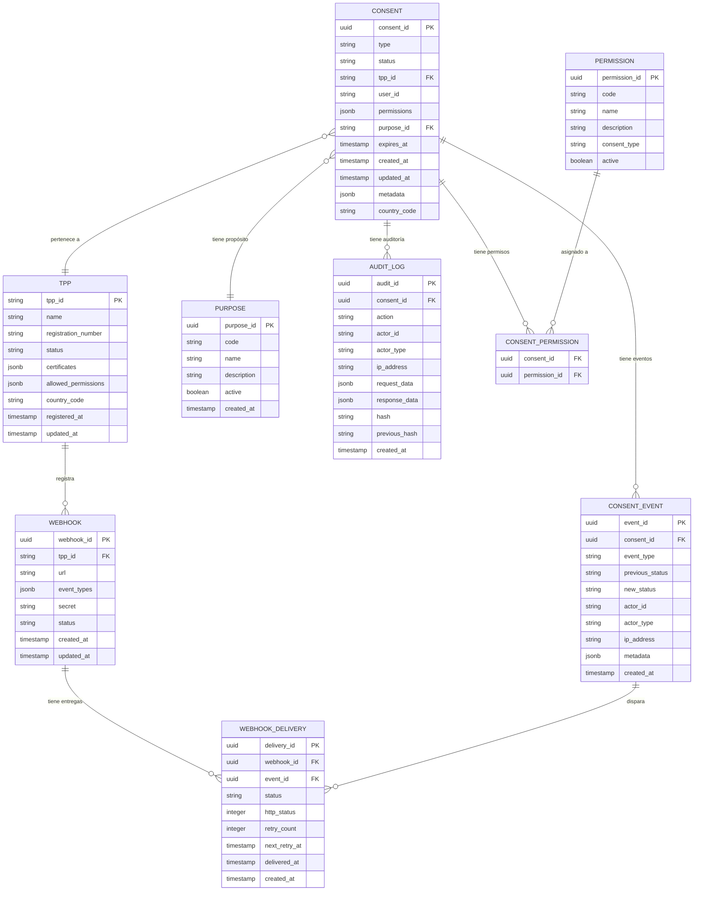

# Modelo de Datos — Consent Manager

## Diagrama Entidad-Relación

## Tablas Detalladas

### consents

| Columna | Tipo | Nullable | Descripción |
|---|---|---|---|
| `consent_id` | UUID | NO | PK - Identificador único |
| `type` | VARCHAR(50) | NO | ACCOUNTS, PAYMENTS, FUNDS_CONFIRMATION |
| `status` | VARCHAR(50) | NO | Estado actual del consentimiento |
| `tpp_id` | VARCHAR(100) | NO | FK - Entidad tercera solicitante |
| `user_id` | VARCHAR(100) | YES | Usuario que otorga (null hasta autorizar) |
| `permissions` | JSONB | NO | Array de permisos otorgados |
| `purpose_id` | UUID | YES | FK - Propósito del consentimiento |
| `expires_at` | TIMESTAMP | NO | Fecha de expiración |
| `authorized_at` | TIMESTAMP | YES | Cuándo se autorizó |
| `revoked_at` | TIMESTAMP | YES | Cuándo se revocó |
| `created_at` | TIMESTAMP | NO | Fecha de creación |
| `updated_at` | TIMESTAMP | NO | Última actualización |
| `metadata` | JSONB | YES | Metadata adicional |
| `country_code` | VARCHAR(3) | NO | País (para multi-región) |
| `redirect_url` | TEXT | YES | URL de redirección post-auth |

**Índices:**
- `idx_consents_user_id` — Búsqueda por usuario
- `idx_consents_tpp_id` — Búsqueda por TPP
- `idx_consents_status` — Filtro por estado
- `idx_consents_type` — Filtro por tipo
- `idx_consents_expires_at` — Job de expiración
- `idx_consents_created_at` — Ordenamiento temporal

### consent_events

| Columna | Tipo | Nullable | Descripción |
|---|---|---|---|
| `event_id` | UUID | NO | PK |
| `consent_id` | UUID | NO | FK - Consentimiento |
| `event_type` | VARCHAR(50) | NO | consent.created, consent.authorized, etc. |
| `previous_status` | VARCHAR(50) | YES | Estado anterior |
| `new_status` | VARCHAR(50) | NO | Estado nuevo |
| `actor_id` | VARCHAR(100) | NO | Quién realizó la acción |
| `actor_type` | VARCHAR(20) | NO | USER, TPP, SYSTEM, ADMIN |
| `ip_address` | VARCHAR(45) | YES | IP de origen |
| `metadata` | JSONB | YES | Datos adicionales |
| `created_at` | TIMESTAMP | NO | Timestamp del evento |

### audit_logs

| Columna | Tipo | Nullable | Descripción |
|---|---|---|---|
| `audit_id` | UUID | NO | PK |
| `consent_id` | UUID | YES | FK - Consentimiento (si aplica) |
| `action` | VARCHAR(50) | NO | CREATE, READ, UPDATE, DELETE, AUTHORIZE, REVOKE |
| `actor_id` | VARCHAR(100) | NO | Quién |
| `actor_type` | VARCHAR(20) | NO | USER, TPP, SYSTEM, ADMIN |
| `ip_address` | VARCHAR(45) | YES | IP (enmascarada) |
| `request_data` | JSONB | YES | Request (sin datos sensibles) |
| `response_data` | JSONB | YES | Response (sin datos sensibles) |
| `hash` | VARCHAR(64) | NO | SHA-256 del registro |
| `previous_hash` | VARCHAR(64) | NO | Hash del registro anterior (cadena) |
| `created_at` | TIMESTAMP | NO | Timestamp |

**Nota:** La tabla de audit_logs es append-only. No se permiten UPDATE ni DELETE.

### webhooks

| Columna | Tipo | Nullable | Descripción |
|---|---|---|---|
| `webhook_id` | UUID | NO | PK |
| `tpp_id` | VARCHAR(100) | NO | FK - TPP dueño |
| `url` | TEXT | NO | URL de callback |
| `event_types` | JSONB | NO | Eventos suscritos |
| `secret` | VARCHAR(256) | NO | Secret para firma HMAC |
| `status` | VARCHAR(20) | NO | ACTIVE, INACTIVE, FAILED |
| `created_at` | TIMESTAMP | NO | Creación |
| `updated_at` | TIMESTAMP | NO | Última actualización |

### tpp_registry (cache local del directorio)

| Columna | Tipo | Nullable | Descripción |
|---|---|---|---|
| `tpp_id` | VARCHAR(100) | NO | PK - ID en directorio central |
| `name` | VARCHAR(200) | NO | Nombre de la entidad |
| `registration_number` | VARCHAR(50) | NO | Número de registro |
| `status` | VARCHAR(20) | NO | ACTIVE, SUSPENDED, REVOKED |
| `certificates` | JSONB | NO | Certificados públicos |
| `allowed_permissions` | JSONB | NO | Permisos que puede solicitar |
| `country_code` | VARCHAR(3) | NO | País |
| `registered_at` | TIMESTAMP | NO | Fecha de registro |
| `updated_at` | TIMESTAMP | NO | Última sincronización |

---

## Consideraciones de Seguridad en Datos

| Dato | Tratamiento |
|---|---|
| `user_id` | Pseudonimizado en logs, cifrado en reposo |
| `ip_address` | Enmascarado en auditoría (últimos octetos) |
| `request_data` | Sin tokens ni credenciales |
| `webhook secret` | Cifrado con KMS |
| `certificates` | Solo claves públicas |
| Toda la base | Cifrado en reposo (KMS) |
| Conexiones | TLS 1.3 obligatorio |

## Consideraciones de Escalabilidad

| Aspecto | Estrategia |
|---|---|
| Particionamiento | Por `country_code` (preparado para multi-país) |
| Archivado | Consentimientos REVOKED/EXPIRED > 1 año → tabla de archivo |
| Read replicas | Para queries de búsqueda y métricas |
| Cache | Redis para consentimientos activos (hot data) |
| Audit logs | Particionamiento por mes, retención 5 años |
