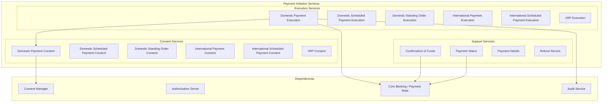
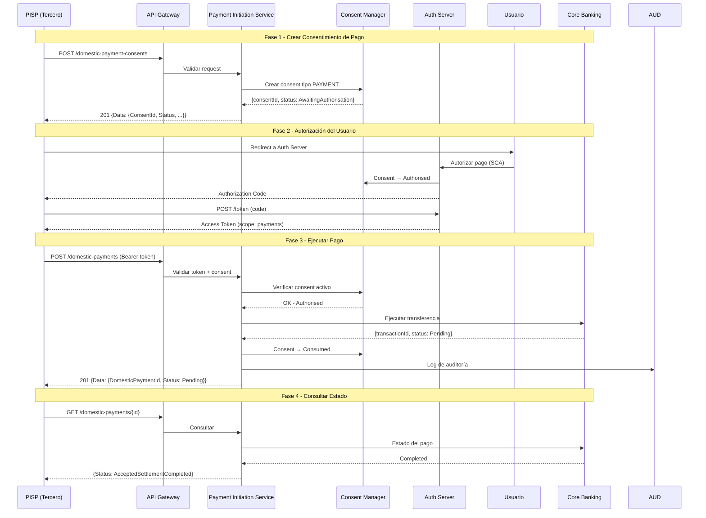
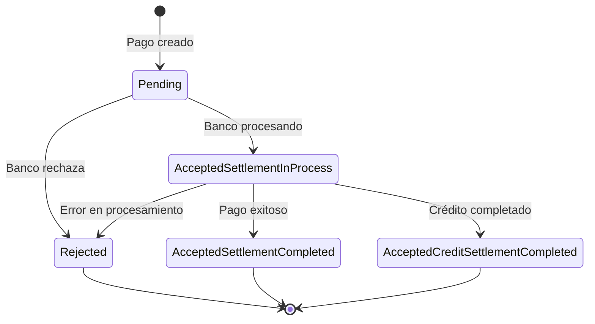

# Servicios de Iniciación de Pagos (Payment Initiation)

## Referencia

Basado en los estándares de Open Banking UK (v4.0), Open Finance Brasil, y la arquitectura de plataformas como Capgemini Open Banking, Sensedia y Ozone API.

Fuentes:
- [Open Banking UK Read/Write API v4.0](https://openbankinguk.github.io/read-write-api-site3/v4.0/)
- [Open Finance Brasil - Payments APIs](https://github.com/OpenBanking-Brasil/openapi)
- [AWS Well-Architected Financial Services Lens](https://docs.aws.amazon.com/wellarchitected/latest/financial-services-industry-lens/open-banking.html)

---

## 1. Visión General

El servicio de Iniciación de Pagos permite a un PISP (Payment Initiation Service Provider) — una entidad tercera autorizada — iniciar pagos en nombre del usuario desde su cuenta bancaria, con su consentimiento explícito.

### Tipos de Pago Soportados

| Tipo | Descripción | Uso |
|---|---|---|
| **Domestic Payment** | Pago inmediato nacional | Transferencias entre cuentas del mismo país |
| **Domestic Scheduled Payment** | Pago programado nacional | Pagos futuros con fecha definida |
| **Domestic Standing Order** | Orden permanente nacional | Pagos recurrentes (mensual, semanal) |
| **International Payment** | Pago inmediato internacional | Transferencias cross-border |
| **International Scheduled Payment** | Pago programado internacional | Pagos internacionales futuros |
| **Variable Recurring Payment (VRP)** | Pago recurrente variable | Sweeping, suscripciones variables |

---

## 2. Arquitectura de Servicios



---

## 3. Flujo Principal — Pago Doméstico



---

## 4. Servicios y Endpoints Detallados

### 4.1 Domestic Payment Consents

| Método | Endpoint | Descripción |
|---|---|---|
| POST | `/domestic-payment-consents` | Crear consentimiento de pago doméstico |
| GET | `/domestic-payment-consents/{ConsentId}` | Obtener detalle del consentimiento |
| GET | `/domestic-payment-consents/{ConsentId}/funds-confirmation` | Confirmar fondos disponibles |

#### Request Body — POST /domestic-payment-consents

```json
{
  "Data": {
    "Initiation": {
      "InstructionIdentification": "ACME412",
      "EndToEndIdentification": "FRESCO.21302.GFX.20",
      "InstructedAmount": {
        "Amount": "165.88",
        "Currency": "COP"
      },
      "CreditorAccount": {
        "SchemeName": "CO.CBB.AccountNumber",
        "Identification": "08080021325698",
        "Name": "ACME Inc"
      },
      "RemittanceInformation": {
        "Reference": "FRESCO-101",
        "Unstructured": "Pago factura 101"
      }
    },
    "Authorisation": {
      "AuthorisationType": "Single",
      "CompletionDateTime": "2026-06-15T15:30:00Z"
    },
    "Risk": {
      "PaymentContextCode": "EcommerceGoods",
      "MerchantCategoryCode": "5967",
      "MerchantCustomerIdentification": "053598653254",
      "DeliveryAddress": {
        "Country": "CO"
      }
    }
  }
}
```

### 4.2 Domestic Payments (Ejecución)

| Método | Endpoint | Descripción |
|---|---|---|
| POST | `/domestic-payments` | Ejecutar pago doméstico |
| GET | `/domestic-payments/{DomesticPaymentId}` | Obtener estado del pago |
| GET | `/domestic-payments/{DomesticPaymentId}/payment-details` | Detalle extendido del pago |

### 4.3 Domestic Scheduled Payment Consents

| Método | Endpoint | Descripción |
|---|---|---|
| POST | `/domestic-scheduled-payment-consents` | Crear consent de pago programado |
| GET | `/domestic-scheduled-payment-consents/{ConsentId}` | Obtener consent |

### 4.4 Domestic Scheduled Payments

| Método | Endpoint | Descripción |
|---|---|---|
| POST | `/domestic-scheduled-payments` | Crear pago programado |
| GET | `/domestic-scheduled-payments/{id}` | Obtener estado |

### 4.5 Domestic Standing Order Consents

| Método | Endpoint | Descripción |
|---|---|---|
| POST | `/domestic-standing-order-consents` | Crear consent de orden permanente |
| GET | `/domestic-standing-order-consents/{ConsentId}` | Obtener consent |

### 4.6 Domestic Standing Orders

| Método | Endpoint | Descripción |
|---|---|---|
| POST | `/domestic-standing-orders` | Crear orden permanente |
| GET | `/domestic-standing-orders/{id}` | Obtener estado |

### 4.7 International Payment Consents

| Método | Endpoint | Descripción |
|---|---|---|
| POST | `/international-payment-consents` | Crear consent de pago internacional |
| GET | `/international-payment-consents/{ConsentId}` | Obtener consent |
| GET | `/international-payment-consents/{ConsentId}/funds-confirmation` | Confirmar fondos |

### 4.8 International Payments

| Método | Endpoint | Descripción |
|---|---|---|
| POST | `/international-payments` | Ejecutar pago internacional |
| GET | `/international-payments/{id}` | Obtener estado |
| GET | `/international-payments/{id}/payment-details` | Detalle extendido |

### 4.9 International Scheduled Payment Consents

| Método | Endpoint | Descripción |
|---|---|---|
| POST | `/international-scheduled-payment-consents` | Crear consent |
| GET | `/international-scheduled-payment-consents/{ConsentId}` | Obtener consent |
| GET | `/international-scheduled-payment-consents/{ConsentId}/funds-confirmation` | Confirmar fondos |

### 4.10 International Scheduled Payments

| Método | Endpoint | Descripción |
|---|---|---|
| POST | `/international-scheduled-payments` | Crear pago programado internacional |
| GET | `/international-scheduled-payments/{id}` | Obtener estado |

### 4.11 Variable Recurring Payments (VRP)

| Método | Endpoint | Descripción |
|---|---|---|
| POST | `/domestic-vrp-consents` | Crear consent VRP |
| GET | `/domestic-vrp-consents/{ConsentId}` | Obtener consent |
| DELETE | `/domestic-vrp-consents/{ConsentId}` | Revocar consent VRP |
| POST | `/domestic-vrps` | Ejecutar pago VRP |
| GET | `/domestic-vrps/{id}` | Obtener estado |
| GET | `/domestic-vrps/{id}/payment-details` | Detalle |

---

## 5. Estados del Pago



### Estados del Consentimiento de Pago

| Estado | Descripción |
|---|---|
| `AwaitingAuthorisation` | Esperando que el usuario autorice |
| `Authorised` | Usuario autorizó el pago |
| `Rejected` | Usuario rechazó o expiró |
| `Consumed` | Pago ejecutado bajo este consent |
| `Revoked` | Consent revocado antes de ejecutar |

### Estados de Ejecución del Pago

| Estado | Descripción |
|---|---|
| `Pending` | Pago enviado, esperando procesamiento |
| `AcceptedSettlementInProcess` | Banco está procesando |
| `AcceptedSettlementCompleted` | Pago completado exitosamente |
| `AcceptedCreditSettlementCompleted` | Crédito al beneficiario completado |
| `Rejected` | Pago rechazado |

---

## 6. Modelo de Datos

### Payment Consent

```json
{
  "Data": {
    "ConsentId": "58923",
    "CreationDateTime": "2026-06-01T06:06:06Z",
    "Status": "AwaitingAuthorisation",
    "StatusUpdateDateTime": "2026-06-01T06:06:06Z",
    "CutOffDateTime": "2026-06-01T16:00:00Z",
    "Initiation": {
      "InstructionIdentification": "ACME412",
      "EndToEndIdentification": "FRESCO.21302.GFX.20",
      "InstructedAmount": {
        "Amount": "165.88",
        "Currency": "COP"
      },
      "DebtorAccount": {
        "SchemeName": "CO.CBB.AccountNumber",
        "Identification": "11280001234567"
      },
      "CreditorAccount": {
        "SchemeName": "CO.CBB.AccountNumber",
        "Identification": "08080021325698",
        "Name": "ACME Inc"
      },
      "RemittanceInformation": {
        "Reference": "FRESCO-101"
      }
    },
    "Authorisation": {
      "AuthorisationType": "Single",
      "CompletionDateTime": "2026-06-15T15:30:00Z"
    },
    "Risk": {
      "PaymentContextCode": "EcommerceGoods"
    }
  }
}
```

### Payment Execution Response

```json
{
  "Data": {
    "DomesticPaymentId": "58923-001",
    "ConsentId": "58923",
    "CreationDateTime": "2026-06-01T06:06:36Z",
    "Status": "AcceptedSettlementInProcess",
    "StatusUpdateDateTime": "2026-06-01T06:06:40Z",
    "Initiation": { "..." },
    "Charges": [
      {
        "ChargeBearer": "BorneByDebtor",
        "Type": "TransferFee",
        "Amount": {
          "Amount": "0.50",
          "Currency": "COP"
        }
      }
    ]
  }
}
```

---

## 7. Servicios Internos del Microservicio

| Servicio | Responsabilidad |
|---|---|
| **Payment Consent Service** | CRUD de consentimientos de pago |
| **Payment Execution Service** | Orquestación de la ejecución del pago |
| **Payment Status Service** | Consulta y actualización de estados |
| **Funds Confirmation Service** | Verificar disponibilidad de fondos |
| **Payment Validation Service** | Validar datos del pago (IBAN, monto, moneda) |
| **Payment Routing Service** | Determinar rail de pago (ACH, RTGS, instant) |
| **Idempotency Service** | Garantizar idempotencia (x-idempotency-key) |
| **Payment Notification Service** | Webhooks de cambio de estado |
| **Payment Audit Service** | Registro de auditoría por operación |
| **Charges Service** | Cálculo y aplicación de comisiones |

---

## 8. Consideraciones Técnicas

### Idempotencia
- Todas las operaciones POST deben soportar `x-idempotency-key`
- Si se recibe la misma key, retornar el resultado original sin re-ejecutar

### Seguridad
- mTLS obligatorio entre TPP y Gateway
- Token OAuth2 con scope `payments`
- Consent debe estar en estado `Authorised` para ejecutar
- SCA (Strong Customer Authentication) requerida para autorizar

### Cut-off Time
- Los pagos tienen un horario de corte (`CutOffDateTime`)
- Después del corte, el pago se puede rechazar o aceptar para el siguiente día hábil

### ISO 20022
- Los payloads de pago se basan en ISO 20022 pain.001
- Campos como `InstructionIdentification`, `EndToEndIdentification` siguen el estándar

---

## 9. Resumen de Endpoints

| Recurso | POST | GET | DELETE | Total |
|---|:---:|:---:|:---:|:---:|
| domestic-payment-consents | ✅ | ✅ + funds | — | 3 |
| domestic-payments | ✅ | ✅ + details | — | 3 |
| domestic-scheduled-payment-consents | ✅ | ✅ | — | 2 |
| domestic-scheduled-payments | ✅ | ✅ | — | 2 |
| domestic-standing-order-consents | ✅ | ✅ | — | 2 |
| domestic-standing-orders | ✅ | ✅ | — | 2 |
| international-payment-consents | ✅ | ✅ + funds | — | 3 |
| international-payments | ✅ | ✅ + details | — | 3 |
| international-scheduled-payment-consents | ✅ | ✅ + funds | — | 3 |
| international-scheduled-payments | ✅ | ✅ | — | 2 |
| domestic-vrp-consents | ✅ | ✅ | ✅ | 3 |
| domestic-vrps | ✅ | ✅ + details | — | 3 |
| **TOTAL** | | | | **~31 endpoints** |
