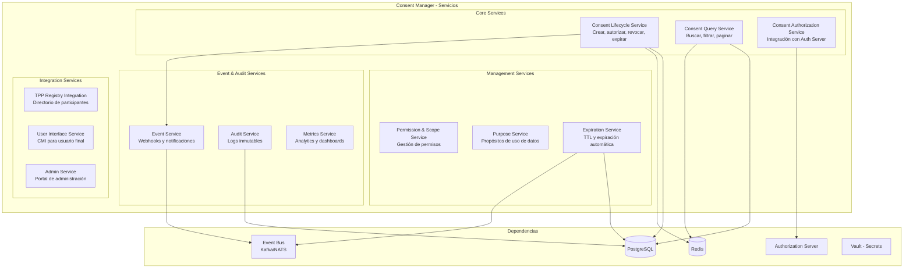
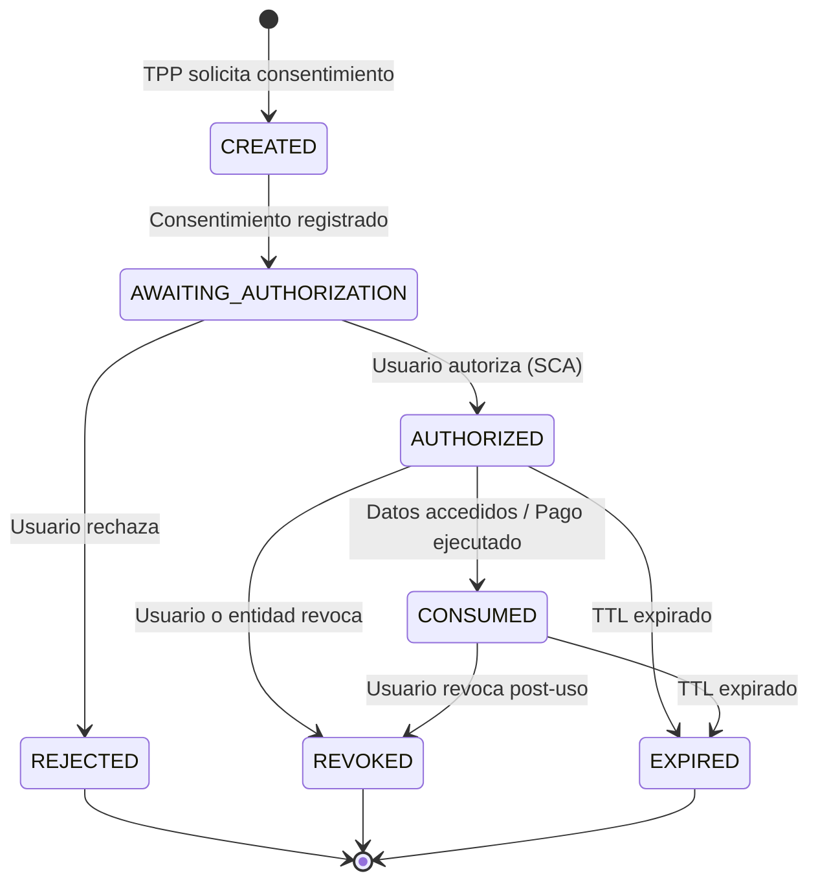
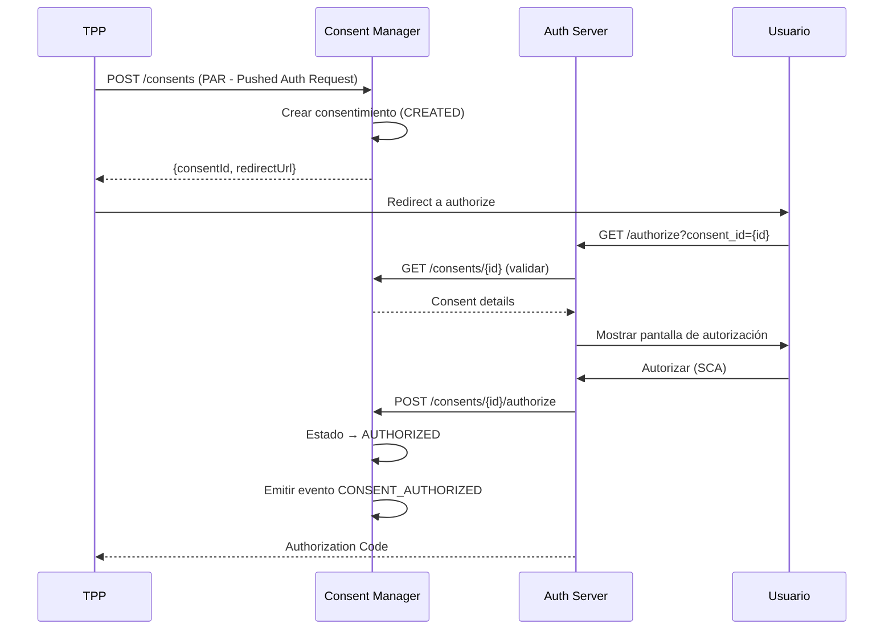

# Servicios del Consent Manager — Definición Técnica

## Visión General

El Consent Manager es el componente central que gestiona el ciclo de vida completo del consentimiento del usuario en el ecosistema de Open Finance. Basado en el análisis de Ozone, Sensedia, Immuta, Didomi y Osano, se definen los siguientes servicios.

---

## Arquitectura de Servicios



---

## Servicios Detallados

### 1. Consent Lifecycle Service (CRÍTICO)

**Responsabilidad:** Gestionar el ciclo de vida completo de un consentimiento.

#### Máquina de Estados



#### Operaciones

| Operación | Método | Endpoint | Descripción |
|---|---|---|---|
| Crear consentimiento | POST | `/consents` | TPP solicita nuevo consentimiento |
| Obtener consentimiento | GET | `/consents/{consentId}` | Consultar detalle de un consentimiento |
| Actualizar estado | PATCH | `/consents/{consentId}/status` | Cambiar estado (interno) |
| Autorizar | POST | `/consents/{consentId}/authorize` | Usuario autoriza el consentimiento |
| Rechazar | POST | `/consents/{consentId}/reject` | Usuario rechaza el consentimiento |
| Revocar | DELETE | `/consents/{consentId}` | Revocar consentimiento activo |

#### Modelo de datos principal

```json
{
  "consentId": "uuid",
  "type": "ACCOUNTS | PAYMENTS | FUNDS_CONFIRMATION",
  "status": "CREATED | AWAITING_AUTHORIZATION | AUTHORIZED | CONSUMED | REJECTED | REVOKED | EXPIRED",
  "tppId": "string",
  "userId": "string",
  "permissions": ["READ_ACCOUNTS", "READ_BALANCES", "READ_TRANSACTIONS"],
  "purpose": "string",
  "expiresAt": "ISO8601",
  "createdAt": "ISO8601",
  "updatedAt": "ISO8601",
  "metadata": {}
}
```

---

### 2. Consent Query Service (CRÍTICO)

**Responsabilidad:** Búsqueda, filtrado y paginación de consentimientos.

#### Operaciones

| Operación | Método | Endpoint | Descripción |
|---|---|---|---|
| Listar por usuario | GET | `/consents?userId={id}` | Todos los consentimientos de un usuario |
| Listar por TPP | GET | `/consents?tppId={id}` | Todos los consentimientos de un TPP |
| Buscar con filtros | GET | `/consents?status={s}&type={t}&from={d}&to={d}` | Búsqueda avanzada |
| Historial de un consentimiento | GET | `/consents/{consentId}/history` | Todos los cambios de estado |

#### Filtros soportados

| Filtro | Tipo | Descripción |
|---|---|---|
| `userId` | string | Filtrar por usuario |
| `tppId` | string | Filtrar por entidad tercera |
| `status` | enum | Filtrar por estado |
| `type` | enum | Filtrar por tipo (accounts, payments) |
| `fromDate` / `toDate` | date | Rango de fechas |
| `page` / `pageSize` | int | Paginación |
| `sort` | string | Ordenamiento |

---

### 3. Consent Authorization Service (CRÍTICO)

**Responsabilidad:** Integración con el Authorization Server para el flujo FAPI 2.0.

#### Flujo



#### Operaciones

| Operación | Método | Endpoint | Descripción |
|---|---|---|---|
| Validar consentimiento para auth | GET | `/consents/{consentId}/validate` | Auth Server valida antes de mostrar pantalla |
| Señalizar autorización | POST | `/consents/{consentId}/authorize` | Auth Server notifica que usuario autorizó |
| Señalizar rechazo | POST | `/consents/{consentId}/reject` | Auth Server notifica que usuario rechazó |
| Verificar vigencia | GET | `/consents/{consentId}/active` | Gateway verifica si consentimiento sigue activo |

---

### 4. Permission & Scope Service (ALTO)

**Responsabilidad:** Gestionar los permisos y alcances de cada consentimiento.

#### Permisos definidos (Open Finance)

| Permiso | Descripción | Tipo de consentimiento |
|---|---|---|
| `READ_ACCOUNTS_BASIC` | Información básica de cuentas | ACCOUNTS |
| `READ_ACCOUNTS_DETAIL` | Detalle completo de cuentas | ACCOUNTS |
| `READ_BALANCES` | Saldos de cuentas | ACCOUNTS |
| `READ_TRANSACTIONS_BASIC` | Movimientos básicos | ACCOUNTS |
| `READ_TRANSACTIONS_DETAIL` | Movimientos con detalle | ACCOUNTS |
| `READ_PRODUCTS` | Productos financieros | ACCOUNTS |
| `INITIATE_PAYMENT` | Iniciar un pago | PAYMENTS |
| `READ_PAYMENT_STATUS` | Consultar estado de pago | PAYMENTS |
| `CONFIRM_FUNDS` | Confirmar disponibilidad de fondos | FUNDS_CONFIRMATION |

#### Operaciones

| Operación | Método | Endpoint | Descripción |
|---|---|---|---|
| Listar permisos disponibles | GET | `/permissions` | Catálogo de permisos |
| Obtener permisos de un consentimiento | GET | `/consents/{id}/permissions` | Permisos otorgados |
| Validar permiso | GET | `/consents/{id}/permissions/{perm}/check` | ¿Tiene este permiso? |

---

### 5. Purpose Service (ALTO)

**Responsabilidad:** Gestionar los propósitos para los cuales se comparten los datos.

#### Operaciones

| Operación | Método | Endpoint | Descripción |
|---|---|---|---|
| Crear propósito | POST | `/purposes` | Registrar nuevo propósito |
| Listar propósitos | GET | `/purposes` | Catálogo de propósitos |
| Asociar propósito a consentimiento | POST | `/consents/{id}/purposes` | Vincular propósito |
| Obtener propósitos de un consentimiento | GET | `/consents/{id}/purposes` | Propósitos asociados |

#### Propósitos estándar Open Finance

| Propósito | Descripción |
|---|---|
| `ACCOUNT_INFORMATION` | Acceso a información de cuentas |
| `PAYMENT_INITIATION` | Iniciación de pagos |
| `FUNDS_CONFIRMATION` | Confirmación de fondos |
| `FINANCIAL_AGGREGATION` | Agregación financiera |
| `CREDIT_SCORING` | Evaluación crediticia |
| `PERSONAL_FINANCE_MANAGEMENT` | Gestión de finanzas personales |

---

### 6. Expiration Service (ALTO)

**Responsabilidad:** Gestionar la expiración automática de consentimientos.

#### Reglas de expiración

| Tipo | TTL por defecto | Configurable |
|---|---|---|
| ACCOUNTS | 12 meses | Sí (máx. regulatorio) |
| PAYMENTS | Single-use o 24h | Sí |
| FUNDS_CONFIRMATION | 24h | Sí |

#### Operaciones

| Operación | Descripción |
|---|---|
| Scheduled Job | Cron que revisa consentimientos próximos a expirar |
| Notificación pre-expiración | Evento 7 días antes de expirar |
| Expiración automática | Cambio de estado a EXPIRED cuando se cumple TTL |
| Renovación | Extender TTL (requiere re-autorización) |

---

### 7. Event Service (ALTO)

**Responsabilidad:** Emitir eventos y webhooks cuando cambia el estado de un consentimiento.

#### Eventos emitidos

| Evento | Cuándo se emite |
|---|---|
| `consent.created` | Nuevo consentimiento registrado |
| `consent.authorized` | Usuario autorizó |
| `consent.rejected` | Usuario rechazó |
| `consent.revoked` | Consentimiento revocado |
| `consent.expired` | Consentimiento expiró |
| `consent.consumed` | Datos accedidos bajo este consentimiento |
| `consent.expiring_soon` | 7 días antes de expirar |

#### Operaciones

| Operación | Método | Endpoint | Descripción |
|---|---|---|---|
| Registrar webhook | POST | `/webhooks` | TPP registra URL de callback |
| Listar webhooks | GET | `/webhooks` | Webhooks registrados |
| Eliminar webhook | DELETE | `/webhooks/{id}` | Desregistrar |
| Historial de eventos | GET | `/consents/{id}/events` | Eventos emitidos para un consentimiento |

---

### 8. Audit Service (CRÍTICO)

**Responsabilidad:** Registro inmutable de todas las operaciones sobre consentimientos.

#### Campos del registro de auditoría

| Campo | Descripción |
|---|---|
| `auditId` | ID único del registro |
| `timestamp` | Fecha y hora exacta (UTC) |
| `consentId` | Consentimiento afectado |
| `action` | Acción realizada (CREATE, AUTHORIZE, REVOKE, etc.) |
| `actor` | Quién realizó la acción (userId, tppId, system) |
| `actorType` | Tipo de actor (USER, TPP, SYSTEM, ADMIN) |
| `previousState` | Estado anterior |
| `newState` | Estado nuevo |
| `ipAddress` | IP de origen (enmascarada si necesario) |
| `metadata` | Datos adicionales |
| `hash` | Hash del registro para integridad |

#### Operaciones

| Operación | Método | Endpoint | Descripción |
|---|---|---|---|
| Consultar auditoría | GET | `/audit?consentId={id}` | Logs de un consentimiento |
| Consultar por actor | GET | `/audit?actorId={id}` | Acciones de un actor |
| Consultar por rango | GET | `/audit?from={d}&to={d}` | Logs en un período |
| Exportar | GET | `/audit/export` | Exportar para regulador |

#### Requisitos
- Logs inmutables (append-only)
- Retención mínima 5 años
- Campos sensibles enmascarados/cifrados
- Hash encadenado para detectar manipulación

---

### 9. Metrics Service (MEDIO)

**Responsabilidad:** Analytics y métricas operativas del consent manager.

#### Métricas principales

| Métrica | Descripción |
|---|---|
| `consents_created_total` | Total de consentimientos creados |
| `consents_authorized_total` | Total autorizados |
| `consents_revoked_total` | Total revocados |
| `consents_expired_total` | Total expirados |
| `consents_rejected_total` | Total rechazados |
| `consent_authorization_rate` | % de consentimientos que se autorizan |
| `consent_avg_lifetime` | Tiempo promedio de vida de un consentimiento |
| `consents_active_current` | Consentimientos activos en este momento |
| `consents_by_tpp` | Distribución por TPP |
| `consents_by_type` | Distribución por tipo |
| `consent_latency_p99` | Latencia P99 de operaciones |

#### Operaciones

| Operación | Método | Endpoint | Descripción |
|---|---|---|---|
| Métricas generales | GET | `/metrics/summary` | Resumen de métricas |
| Métricas por TPP | GET | `/metrics/tpp/{tppId}` | Métricas de un TPP |
| Métricas por período | GET | `/metrics?from={d}&to={d}` | Métricas en rango |
| Prometheus endpoint | GET | `/metrics/prometheus` | Para scraping |

---

### 10. TPP Registry Integration Service (ALTO)

**Responsabilidad:** Integración con el directorio central de participantes.

#### Operaciones

| Operación | Método | Endpoint | Descripción |
|---|---|---|---|
| Validar TPP | GET | `/tpp/{tppId}/validate` | Verificar que TPP está registrado y activo |
| Obtener info TPP | GET | `/tpp/{tppId}` | Metadata del TPP (nombre, certificados, permisos) |
| Sincronizar directorio | POST | `/tpp/sync` | Actualizar registro local desde directorio central |

---

### 11. User Interface Service — CMI (MEDIO)

**Responsabilidad:** Proveer datos para la interfaz de gestión del usuario final.

#### Operaciones

| Operación | Método | Endpoint | Descripción |
|---|---|---|---|
| Mis consentimientos | GET | `/users/{userId}/consents` | Consentimientos activos del usuario |
| Detalle para UI | GET | `/users/{userId}/consents/{id}/detail` | Info enriquecida para mostrar en UI |
| Revocar desde UI | DELETE | `/users/{userId}/consents/{id}` | Usuario revoca desde su interfaz |
| Historial del usuario | GET | `/users/{userId}/consents/history` | Historial completo |

---

### 12. Admin Service (MEDIO)

**Responsabilidad:** Operaciones administrativas para la entidad financiera.

#### Operaciones

| Operación | Método | Endpoint | Descripción |
|---|---|---|---|
| Búsqueda avanzada | GET | `/admin/consents/search` | Búsqueda con todos los filtros |
| Revocar por admin | DELETE | `/admin/consents/{id}` | Revocación administrativa |
| Bulk operations | POST | `/admin/consents/bulk-revoke` | Revocación masiva (ej: TPP suspendido) |
| Configuración | GET/PUT | `/admin/config` | Configurar TTLs, permisos, etc. |
| Health check | GET | `/admin/health` | Estado del servicio |

---

## Resumen de Endpoints por Prioridad

### MVP (Fase 1) — 6 servicios, ~20 endpoints

| Servicio | Endpoints |
|---|---|
| Consent Lifecycle | 6 |
| Consent Query | 4 |
| Consent Authorization | 4 |
| Permission & Scope | 3 |
| Audit | 4 |
| Event (webhooks) | 4 |
| **Total MVP** | **~25 endpoints** |

### Fase 2 — 6 servicios adicionales, ~15 endpoints

| Servicio | Endpoints |
|---|---|
| Purpose | 4 |
| Expiration | 3 |
| Metrics | 4 |
| TPP Registry | 3 |
| User Interface (CMI) | 4 |
| Admin | 5 |
| **Total Fase 2** | **~23 endpoints** |

---

## Stack Tecnológico Recomendado

| Componente | Tecnología | Justificación |
|---|---|---|
| Lenguaje | Java (Spring Boot) o Go | Performance, ecosistema enterprise |
| Base de datos | PostgreSQL | Relacional, ACID, JSON support |
| Cache | Redis | Sesiones, rate limiting, lookups rápidos |
| Event Bus | Kafka o NATS | Eventos de consentimiento, webhooks |
| API Spec | OpenAPI 3.1 | Estándar de la industria |
| Auth | FAPI 2.0 / OAuth 2.0 | Requisito regulatorio |
| Contenedor | Docker | Portabilidad multi-nube |
| Orquestación | Kubernetes (Helm) | Despliegue estandarizado |
